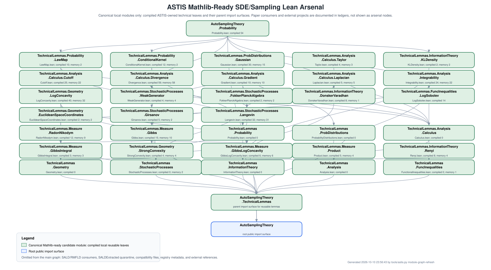

# ASTIS Lean Leaf Module Graph

This is the textual ledger behind `docs/module-graph.svg`.  The graph itself
shows only canonical ASTIS-owned Lean modules that are currently treated as the
Mathlib-ready SDE/Sampling proof-weapon library: compiled reusable leaves and
their parent import surfaces.

The graph is intentionally organized like a Lean module map, following the
style of the public QuantumComputing module graph.  Paper consumers, registry
metadata, compatibility files, and external references are not main graph
nodes.  They are documented below so the reusable arsenal stays visible at a
glance.



## Public Module Tree

```text
Main graph tree:

AutoSamplingTheory
|-- Probability.lean                  shared probability adapter surface
|-- TechnicalLemmas.lean              parent import surface for reusable lemmas
`-- TechnicalLemmas/
    |-- Analysis.lean                 parent for reusable analysis leaves
    |-- Analysis/
    |   |-- Calculus.lean             parent for calculus leaves
    |   `-- Calculus/
    |       |-- Divergence.lean       Mathlib-style pointwise coordinate-divergence bridge
    |       |-- Gradient.lean         Mathlib-style gradient coordinate bridges
    |       |-- Laplacian.lean        Mathlib-style Laplacian coordinate bridges
    |       `-- Taylor.lean           Mathlib-style Taylor/Hessian leaves
    |-- Probability.lean              parent for probability technical lemmas
    |-- Probability/
    |   |-- LawMap.lean               pushforward-law and weak-test rewrites
    |   `-- ConditionalKernel.lean    condDistrib and conditional-integral leaves
    |-- ProbabilityDistributions.lean parent for distribution-specific leaves
    |-- ProbabilityDistributions/
    |   `-- Gaussian.lean             Mathlib-style Gaussian coordinate leaves
    |-- Measure/
    |   |-- Gibbs.lean                ENNReal Gibbs density and normalization bridge
    |   |-- GibbsIntegral.lean        Gibbs withDensity Bochner integral rewrites
    |   |-- GibbsLogConcavity.lean    normalized Gibbs real-density log-concavity bridge
    |   |-- Product.lean              product-measure coordinate update and Fubini leaves
    |   `-- RadonNikodym.lean         withDensity, density transport, and RN normalization leaves
    |-- Geometry.lean                 parent for convex-geometric leaves
    |-- Geometry/
    |   |-- EuclideanSpaceCoordinates.lean finite-dimensional inner-product coordinate bridges
    |   |-- LogConcavity.lean         positive log-concavity, negative-log potential, level-set, and centered/shifted/two-point quadratic Gibbs geometry leaves
    |   `-- StrongConvexity.lean      strong-convexity to log-concavity and quadratic-envelope bridges
    |-- StochasticProcesses.lean      parent for SDE/weak-generator leaves
    |-- StochasticProcesses/
    |   |-- WeakGenerator.lean        sample-to-law weak-generator rewrites
    |   |-- FokkerPlanckAlgebra.lean  FP split and Fisher/IBP algebra leaves
    |   |-- Langevin.lean             finite Langevin expression display and Gibbs-weighted algebra leaves
    |   `-- Girsanov.lean             finite-dimensional cylindrical change-of-measure leaves
    |-- InformationTheory.lean        parent for KL/DV/Renyi/entropy leaves
    |-- InformationTheory/
    |   |-- DonskerVaradhan.lean      one-sided DV and energy bounds
    |   |-- KLDensity.lean            KL density derivative algebra leaves
    |   `-- Renyi.lean                Renyi integrand and derivative leaves
    |-- FunctionalInequalities.lean   parent for LSI/FI/PI-style leaves
    `-- FunctionalInequalities/
        `-- LogSobolev.lean           LSI-to-KL/FI bookkeeping leaves

Compatibility surfaces not shown in the main graph:
|-- TechnicalLemmas/Gaussian.lean
|-- TechnicalLemmas/Taylor.lean
|-- TechnicalLemmas/Measure.lean
`-- TechnicalLemmas/Variational.lean

Non-arsenal files documented separately:
|-- Core.lean, SDE.lean, Automation.lean, Literature.lean, OpenProblems.lean
|-- TechnicalLemmas/Registry.lean
|-- TechnicalLemmas/SALDExtracted.lean
|-- SALD.lean
`-- RMFLD.lean
```

## Log-Concave Sampling Planned Extension

`ASTIS-CHEWI-001` sets the library goal to a log-concave sampling foundation.
`Geometry.LogConcavity` now has
compiled core, density-to-potential extraction, level-set/restriction geometry, map-stability, tensorization algebra, and centered/shifted/two-point quadratic Gibbs geometry leaves; the
remaining planned modules are not callable until they contain ASTIS-owned compiled declarations, but they define the
intended scientific organization for new leaves:

```text
Planned log-concave sampling extension:

AutoSamplingTheory
`-- TechnicalLemmas/
    |-- Measure/
    |   |-- Transport.lean
    |   |-- Gibbs.lean
    |   `-- RadonNikodym.lean
    |-- Geometry/
    |   |-- Convex.lean
    |   |-- LogConcavity.lean  compiled core/potential/level-set/map/tensorization API plus centered/shifted/two-point quadratic Gibbs geometry
    |   `-- PrekopaLeindler.lean
    |-- FunctionalInequalities/
    |   |-- Poincare.lean
    |   |-- Transport.lean
    |   `-- Isoperimetry.lean
    |-- StochasticProcesses/
    |   |-- MarkovSemigroup.lean
    |   |-- Ito.lean
    |   |-- Langevin.lean
    |   |-- Girsanov.lean
    |   |-- DoobTransform.lean
    |   `-- FollmerDrift.lean
    `-- SamplingAlgorithms/
        |-- LangevinMonteCarlo.lean
        |-- RandomizedMidpoint.lean
        |-- HamiltonianMonteCarlo.lean
        |-- UnderdampedLangevin.lean
        |-- MetropolisAdjustedLangevin.lean
        `-- ProximalSampler.lean
```

New modules should be added only when a small, source-anchored leaf is ready.
The next expected expansion is Prekopa-Leindler support and nonquadratic
coercive Gibbs envelopes, with Mathlib searched first and
`Lean-Asymptotic-Statistical-Theory` used as an external reference project.

## Canonical Compiled Module And Leaf Families

| Module | File | Layer | Purpose | Representative compiled leaves/exports | Curated memory entries | Mathlib-quality status |
| --- | --- | --- | --- | --- | --- | --- |
| `AutoSamplingTheory.Probability` | `AutoSamplingTheory\Probability.lean` | generic technical core | law-map rewrites, dominated law derivatives, conditional-law bridges, KL/DV/LSI bookkeeping | `lawMapEqOfAEEq`, `lawMapIntegral`, `lawMapIntegralHasDerivAtOfSample`, `lawIntegralHasDerivAtOfMeasureMapEqAndSample`, `lawMapIntegralHasDerivAtOfDominated`, `lawIntegralHasDerivAtOfMeasureMapEqAndDominated`, `lawMapProdEqOfAEEq`, `lawMapProdFst`, ... | 0 | main Mathlib-ready adapter surface after naming/generalization cleanup |
| `AutoSamplingTheory.TechnicalLemmas.Analysis.Calculus.Cutoff` | `AutoSamplingTheory\TechnicalLemmas\Analysis\Calculus\Cutoff.lean` | Mathlib-ready technical lemma | smooth unit and radial cutoffs, range bounds, support control, compact support, pointwise exhaustion, compact-in-open plateaus, and scale-uniform first- and second-derivative control | `smoothUnitCutoff`, `smoothUnitCutoff_eq_smoothTransition`, `smoothUnitCutoff_contDiff`, `smoothUnitCutoff_eq_one_of_abs_le_one`, `smoothUnitCutoff_eq_zero_of_two_le_abs`, `smoothUnitCutoff_mem_Icc`, `smoothUnitCutoff_hasCompactSupport`, `smoothUnitCutoff_deriv_bounded`, ... | 22 | compiled ANALYSIS/REG/SDE base through O(R^-1) fderiv and O(R^-2) second iterated derivative; the finite-dimensional Laplacian trace consumer is compiled in Laplacian |
| `AutoSamplingTheory.TechnicalLemmas.Analysis.Calculus.Divergence` | `AutoSamplingTheory\TechnicalLemmas\Analysis\Calculus\Divergence.lean` | Mathlib-ready technical lemma | finite-dimensional pointwise coordinate-divergence convention, fderiv trace bridges, radial-cutoff PiLp derivative producer, smulRight basis-trace identity, the generic L1 cutoff-gradient limit and generic cutoff main-term dominated convergence for Integrable fields, a.e. trace transfer, finite-box signed face-term wrappers, and the inner-closed-Pi-box/outer-open-Pi-box plateau specialization | `coordinateDivergence`, `coordinateDivergence_eq_sum_lineDeriv`, `coordinateDivergence_eq_sum_fderiv_apply_of_hasFDerivAt`, `coordinateDivergence_eq_sum_fderiv_apply_of_differentiableAt`, `continuousLinearEquiv_apply_euclideanSpace_single`, `hasFDerivAt_radialSmoothCutoff_comp_toLp`, `tendsto_integral_norm_fderiv_radialSmoothCutoff_comp_toLp_apply`, `tendsto_integral_radialSmoothCutoff_comp_toLp_smul`, ... | 58 | preferred ANALYSIS/SDE bridge for finite-box cancellation and the compiled generic cutoff cross-term/main-term/tail limits; concrete compact-test generator-display integrability and Gibbs-tail convergence are compiled in Langevin, while whole-space IBP, no-boundary passage, and invariant law remain separate |
| `AutoSamplingTheory.TechnicalLemmas.Analysis.Calculus.Gradient` | `AutoSamplingTheory\TechnicalLemmas\Analysis\Calculus\Gradient.lean` | Mathlib-ready technical lemma | Mathlib gradient bridges for Langevin calculus: Gibbs-weight chain rule `∇ exp(-V) = -exp(-V) • ∇V` from `HasGradientAt` or `DifferentiableAt`, coordinate displays, finite-dimensional coordinate-unit line derivatives, and pointwise `fderiv`-to-`gradient` inner-product/coordinate bridges | `hasGradientAt_expNegPotential_of_hasGradientAt`, `gradient_expNegPotential_eq_of_hasGradientAt`, `gradient_expNegPotential_coordinate_eq_of_hasGradientAt`, `gradient_expNegPotential_eq_of_differentiableAt`, `gradient_expNegPotential_coordinate_eq_of_differentiableAt`, `continuous_gradient_of_contDiff_one`, `fderiv_apply_eq_inner_of_hasGradientAt`, `fderiv_apply_eq_inner_gradient_of_differentiableAt`, ... | 10 | preferred ANALYSIS/SDE bridge from Mathlib gradient API to finite-coordinate Langevin algebra; pointwise only, with no divergence, IBP, or invariant-law claims |
| `AutoSamplingTheory.TechnicalLemmas.Analysis.Calculus.Laplacian` | `AutoSamplingTheory\TechnicalLemmas\Analysis\Calculus\Laplacian.lean` | Mathlib-ready technical lemma | finite-dimensional real inner-product-space Laplacian coordinate bridges: Mathlib Laplacian equals the standard orthonormal-basis second-derivative sum, plus source-functional handoff | `laplacian_eq_sum_stdOrthonormalBasis`, `laplacianFunctional_eq_of_stdOrthonormalBasis_sum`, `continuous_laplacian_of_contDiff_two`, `norm_laplacian_le_finrank_mul_norm_iteratedFDeriv_two`, `radialSmoothCutoff_laplacian_bound` | 5 | preferred ANALYSIS/SDE bridge for Langevin generator displays; does not prove IBP, boundary decay, stationarity, or invariant laws |
| `AutoSamplingTheory.TechnicalLemmas.Analysis.Calculus.Taylor` | `AutoSamplingTheory\TechnicalLemmas\Analysis\Calculus\Taylor.lean` | Mathlib-ready technical lemma | Hessian/operator norm bridges, orthonormal-basis units, quadratic normalization | `hessianOpNormOfSourceHessianField`, `iteratedFDerivTwoOpNormOfFDerivFDerivOpNorm`, `quadraticVariationNormalizationOfCoeffDefAndVarianceOne`, `stdOrthonormalBasisUnit` | 3 | preferred Mathlib-style location for Ito/Taylor local-error leaves |
| `AutoSamplingTheory.TechnicalLemmas.Analysis.Calculus` | `AutoSamplingTheory\TechnicalLemmas\Analysis\Calculus.lean` | Mathlib-ready technical lemma | parent import surface for smooth cutoffs, gradient, line-derivative, Laplacian, Taylor/Hessian, pointwise coordinate-divergence, WithLp/Pi a.e. trace bridge, trace-to-coordinate `IntegrableOn` transfer, and finite-box face-term wrapper leaves used by SDE/Sampling proofs | exports/metadata only | 0 | preferred parent module for calculus leaves before explicit trace-integrability, IBP, and domain contracts |
| `AutoSamplingTheory.TechnicalLemmas.Analysis.Integrability` | `AutoSamplingTheory\TechnicalLemmas\Analysis\Integrability.lean` | Mathlib-ready technical lemma | ofReal lintegral/Integrable bridge, finite-dimensional Gaussian quadratic-tail integrability, exact quadratic normalizers, exact one-dimensional Laplace normalizers, and quadratic/Laplace lower-bound Gibbs normalization leaves | `lintegral_ofReal_ne_top_of_integrable_nonneg`, `integrable_exp_neg_mul_norm_sq`, `integrable_exp_neg_add_mul_norm_sq`, `lintegral_exp_neg_add_mul_norm_sq_ne_top`, `integrable_exp_neg_add_mul_norm_sub_sq`, `lintegral_exp_neg_add_mul_norm_sub_sq_ne_top`, `integrable_exp_neg_add_mul_abs`, `lintegral_exp_neg_add_mul_abs_ne_top`, ... | 22 | preferred Mathlib-style location for Lebesgue tail and coercive-envelope leaves; general coercive envelopes remain red |
| `AutoSamplingTheory.TechnicalLemmas.Analysis` | `AutoSamplingTheory\TechnicalLemmas\Analysis.lean` | Mathlib-ready technical lemma | parent import surface for reusable analysis and integrability leaves | exports/metadata only | 0 | preferred parent module for calculus, integrability, regularity, and future IBP leaves |
| `AutoSamplingTheory.TechnicalLemmas.FunctionalInequalities.LogSobolev` | `AutoSamplingTheory\TechnicalLemmas\FunctionalInequalities\LogSobolev.lean` | Mathlib-ready technical lemma | log-Sobolev to KL/FI bookkeeping leaves | `lsiKlFiRnDerivDensityMassOne`, `lsiKlFiRnDerivEntropyIntegral`, `lsiKlFiRnDerivLIntegralMassOne`, `lsiKlFiSqrtDensityEntropyIntegrandScalar`, `lsiKlFiSqrtDensityFisherChainFiniteSumHandoffScalar`, `lsiKlFiSqrtDensityFisherChainFiniteSumScalar`, `lsiKlFiSqrtDensityFisherChainIntegralFiniteSum`, `lsiKlFiSqrtDensityFisherChainIntegralHandoffScalar`, ... | 0 | preferred Mathlib-style location for LSI/FI bookkeeping leaves |
| `AutoSamplingTheory.TechnicalLemmas.FunctionalInequalities` | `AutoSamplingTheory\TechnicalLemmas\FunctionalInequalities.lean` | Mathlib-ready technical lemma | parent import surface for LSI/FI/PI-style technical lemmas | exports/metadata only | 1 | preferred parent module for functional-inequality leaves |
| `AutoSamplingTheory.TechnicalLemmas.Geometry.EuclideanSpaceCoordinates` | `AutoSamplingTheory\TechnicalLemmas\Geometry\EuclideanSpaceCoordinates.lean` | Mathlib-ready technical lemma | finite-dimensional EuclideanSpace coordinate bridges, including inner-product coordinate-sum identities for direct vectors and `WithLp.toLp 2` coordinate functions | `euclideanSpace_inner_toLp_toLp_eq_sum_mul`, `euclideanSpace_inner_eq_sum_mul` | 2 | preferred shared GEOM/GAUSS/SDE notation bridge; does not define gradients, divergence, Laplacian, or analytic regularity |
| `AutoSamplingTheory.TechnicalLemmas.Geometry.LogConcavity` | `AutoSamplingTheory\TechnicalLemmas\Geometry\LogConcavity.lean` | Mathlib-ready technical lemma | positive-function log-concavity API over Mathlib ConcaveOn; negative-log potential convexity and energy sublevels; quasiconcavity, convex superlevel sets, and restricted superlevel log-concavity; linear/affine precomposition; products, nonnegative powers, product-domain tensorization; norm-square, absolute-linear, and centered/shifted/two-point quadratic-potential convexity; explicit normalized quadratic, Laplace, and Gaussian-kernel log-concavity | `LogConcaveOn`, `logConcaveOn_iff`, `logConcaveOn_of_concave_log`, `LogConcaveOn.pos`, `LogConcaveOn.concaveOn_log`, `LogConcaveOn.convexOn_neg_log`, `LogConcaveOn.convex_sublevel_neg_log`, `LogConcaveOn.convex_domain`, ... | 32 | compiled CONV/DENS leaf with density-to-potential extraction, level-set/restriction geometry, map-stability, algebra, one-dimensional Laplace geometry, and centered/shifted/two-point quadratic Gibbs geometry; extend toward Prekopa-Leindler interfaces |
| `AutoSamplingTheory.TechnicalLemmas.Geometry.StrongConvexity` | `AutoSamplingTheory\TechnicalLemmas\Geometry\StrongConvexity.lean` | Mathlib-ready technical lemma | strong-convexity to convex-potential/log-concave Gibbs-shape bridges and the midpoint `k/4` centered quadratic lower envelope from a supplied global minimizer | `convexOn_of_strongConvexOn_nonneg`, `logConcaveOn_exp_neg_of_strongConvexOn`, `logConcaveOn_const_mul_exp_neg_of_strongConvexOn`, `centered_quadratic_lower_bound_of_strongConvexOn_minimizer` | 4 | compiled CONV/DENS bridge; sharp `k/2` first-order envelope and minimizer-existence theory remain separate red branches |
| `AutoSamplingTheory.TechnicalLemmas.Geometry` | `AutoSamplingTheory\TechnicalLemmas\Geometry.lean` | Mathlib-ready technical lemma | parent import surface for convex-geometric and log-concavity leaves | exports/metadata only | 0 | preferred parent module for CONV/DENS roots |
| `AutoSamplingTheory.TechnicalLemmas.InformationTheory.DonskerVaradhan` | `AutoSamplingTheory\TechnicalLemmas\InformationTheory\DonskerVaradhan.lean` | Mathlib-ready technical lemma | Donsker--Varadhan one-sided and scaled-test energy leaves | `dvFiniteLogMgfOfLeAlpha`, `dvVariationalOneSidedConsequenceScalar`, `dvVariationalOneSidedFromSupremumScalar`, `dvVariationalOneSidedOfScaledTest`, `dvVariationalOneSidedOfTiltedRight`, `dvVariationalScaledTestEnergyBound`, `dvVariationalScaledTestEnergyBoundWithCoeff`, `dvVariationalTiltedRightOneSidedConsequence` | 1 | preferred Mathlib-style location for DV/KL energy leaves |
| `AutoSamplingTheory.TechnicalLemmas.InformationTheory.KLDensity` | `AutoSamplingTheory\TechnicalLemmas\InformationTheory\KLDensity.lean` | Mathlib-ready technical lemma | KL-density pointwise derivative and mass-conservation algebra leaves | `klPointwiseDerivSimplify`, `klDerivativeRemoveMassTerm` | 2 | preferred Mathlib-style location for KL density algebra after analytic domination is supplied |
| `AutoSamplingTheory.TechnicalLemmas.InformationTheory.Renyi` | `AutoSamplingTheory\TechnicalLemmas\InformationTheory\Renyi.lean` | Mathlib-ready technical lemma | Renyi density integrand positivity, measurability, finite-envelope, and pointwise derivative algebra leaves | `renyiIntegrand`, `renyiIntegrandENNReal`, `renyiIntegrand_nonneg`, `renyiIntegrand_pos`, `measurable_renyiIntegrand`, `measurable_renyiIntegrandENNReal`, `lintegral_renyiIntegrandENNReal_ne_top_of_ae_le`, `hasDerivAt_renyiIntegrand` | 4 | preferred Mathlib-style location for Renyi density algebra before integral/path regularity contracts |
| `AutoSamplingTheory.TechnicalLemmas.InformationTheory` | `AutoSamplingTheory\TechnicalLemmas\InformationTheory.lean` | Mathlib-ready technical lemma | parent import surface for KL/DV/Renyi/entropy technical lemmas | exports/metadata only | 0 | preferred parent module for information-theoretic leaves |
| `AutoSamplingTheory.TechnicalLemmas.Measure.Gibbs` | `AutoSamplingTheory\TechnicalLemmas\Measure\Gibbs.lean` | Mathlib-ready technical lemma | ENNReal Gibbs density, positivity/finite-value, measurability, nonzero/finite-by-envelope, potential-envelope, and finite-measure lower-bound integral contracts, plus normalized withDensity probability bridges | `gibbsDensityENNReal`, `gibbsDensityENNReal_pos`, `gibbsDensityENNReal_lt_top`, `measurable_gibbsDensityENNReal`, `aemeasurable_gibbsDensityENNReal`, `lintegral_gibbsDensityENNReal_ne_zero`, `lintegral_gibbsDensityENNReal_ne_top_of_ae_le`, `gibbsDensityENNReal_le_of_potential_ge`, ... | 10 | preferred Mathlib-style location for Gibbs target-measure wrappers |
| `AutoSamplingTheory.TechnicalLemmas.Measure.GibbsIntegral` | `AutoSamplingTheory\TechnicalLemmas\Measure\GibbsIntegral.lean` | Mathlib-ready technical lemma | Bochner integral rewrites for Gibbs withDensity measures, turning `Z⁻¹ * gibbsDensityENNReal V` integrals into real `Z.toReal⁻¹ * exp(-V)` weighted base-measure integrals | `integral_withDensity_inv_mul_gibbsDensityENNReal_eq_integral_inv_mul_exp_smul`, `integral_withDensity_lintegral_inv_mul_gibbsDensityENNReal_eq_integral_lintegral_inv_mul_exp_smul`, `integral_withDensity_lintegral_inv_mul_gibbsDensityENNReal_eq_integral_lintegral_inv_mul_exp_smul_of_neZero` | 3 | preferred bridge from Gibbs target-measure wrappers to weak-generator, invariant-law, and KL/FI test-function algebra; does not prove normalization |
| `AutoSamplingTheory.TechnicalLemmas.Measure.GibbsLogConcavity` | `AutoSamplingTheory\TechnicalLemmas\Measure\GibbsLogConcavity.lean` | Mathlib-ready technical lemma | finite nonzero ENNReal normalizer bridge from normalized Gibbs densities to real-valued LogConcaveOn shapes for convex and strongly convex potentials | `logConcaveOn_normalized_gibbsDensityENNReal_toReal_of_convexOn`, `logConcaveOn_normalized_gibbsDensityENNReal_toReal_of_strongConvexOn`, `logConcaveOn_lintegral_normalized_gibbsDensityENNReal_toReal_of_convexOn`, `logConcaveOn_lintegral_normalized_gibbsDensityENNReal_toReal_of_strongConvexOn`, `logConcaveOn_lintegral_normalized_gibbsDensityENNReal_toReal_of_strongConvexOn_minimizer`, `logConcaveOn_normalized_laplace_gibbsDensityENNReal_toReal` | 6 | preferred bridge between measure-facing Gibbs density wrappers and real-valued log-concavity geometry; does not prove normalizer finiteness |
| `AutoSamplingTheory.TechnicalLemmas.Measure.Product` | `AutoSamplingTheory\TechnicalLemmas\Measure\Product.lean` | Mathlib-ready technical lemma | finite product-measure coordinate replacement map, measure-preserving wrapper, Bochner integral rewrite, and a.e. slice integrability for `Function.update` coordinate refreshes | `measurable_update_prod_pi`, `map_update_prod_pi`, `measurePreserving_update_prod_pi`, `integral_update_prod_pi_eq_integral`, `integrable_update_slice_ae` | 4 | preferred Mathlib-style location for product-measure coordinate update and slice/Fubini leaves; does not prove kernels, entropy, LSI, or invariance |
| `AutoSamplingTheory.TechnicalLemmas.Measure.RadonNikodym` | `AutoSamplingTheory\TechnicalLemmas\Measure\RadonNikodym.lean` | Mathlib-ready technical lemma | withDensity mass, reciprocal-lintegral normalization, finite-pi product density decomposition, measurable-equivalence density transport, absolute-continuity, and RN reconstruction wrappers | `lintegral_fin_nat_prod_eq_prod`, `lintegral_fintype_prod_eq_prod`, `pi_withDensity_prod`, `withDensity_univ_eq_lintegral`, `isProbabilityMeasure_withDensity_of_lintegral_eq_one`, `isProbabilityMeasure_withDensity_ofReal_exp_of_integral_eq_one`, `isFiniteMeasure_withDensity_of_lintegral_ne_top`, `lintegral_inv_lintegral_mul_eq_one`, ... | 9 | preferred Mathlib-style location for density normalization and RN derivative leaves |
| `AutoSamplingTheory.TechnicalLemmas.Probability.ConditionalKernel` | `AutoSamplingTheory\TechnicalLemmas\Probability\ConditionalKernel.lean` | Mathlib-ready technical lemma | condDistrib/condExpKernel bridges and conditional-integral regularity leaves | `condDistribIntegralNamedFieldIntegral`, `condDistribAeEqCondExpKernelMap`, `condDistribIntegralAEStronglyMeasurable`, `condDistribIntegralIntegrable`, `condDistribIntegralMapAEStronglyMeasurable`, `condDistribIntegralMapIntegrable`, `condDistribIntegralMapIntegral`, `condDistribIntegralNamedFieldRegularity`, ... | 2 | preferred Mathlib-style location for conditional-kernel leaves |
| `AutoSamplingTheory.TechnicalLemmas.Probability.LawMap` | `AutoSamplingTheory\TechnicalLemmas\Probability\LawMap.lean` | Mathlib-ready technical lemma | pushforward law, weak-test integral, and dominated derivative transport leaves | `lawIntegralHasDerivAtOfMeasureMapEqAndDominated`, `lawIntegralHasDerivAtOfMeasureMapEqAndSample`, `lawMapEqOfAEEq`, `lawMapIntegral`, `lawMapIntegralHasDerivAtOfDominated`, `lawMapIntegralHasDerivAtOfSample`, `lawMapProdEqOfAEEq`, `lawMapProdFst`, ... | 2 | preferred Mathlib-style location for law-map leaves |
| `AutoSamplingTheory.TechnicalLemmas.Probability` | `AutoSamplingTheory\TechnicalLemmas\Probability.lean` | Mathlib-ready technical lemma | parent import surface for probability technical lemmas | exports/metadata only | 0 | preferred parent module for law-map and conditional-kernel leaves |
| `AutoSamplingTheory.TechnicalLemmas.ProbabilityDistributions.Gaussian` | `AutoSamplingTheory\TechnicalLemmas\ProbabilityDistributions\Gaussian.lean` | Mathlib-ready technical lemma | Gaussian coordinate laws, finite linear-form integrability/mean-zero, product MGF normalizers, Esscher shifted densities/change-of-measure, EuclideanSpace/stdGaussian change-of-measure bridges, and variance-one packaging | `gaussianReal_withDensity_exp_shift`, `inner_toLp_toLp_eq_sum_mul`, `integrable_const_mul_eval_stdGaussianPi`, `integrable_const_mul_sq_gaussianReal_zero`, `integrable_eval_stdGaussianPi`, `integrable_linearForm_stdGaussianPi`, `integrable_sq_eval_stdGaussianPi`, `integral_const_mul_eval_stdGaussianPi`, ... | 15 | preferred Mathlib-style location for Gaussian/Brownian increment leaves |
| `AutoSamplingTheory.TechnicalLemmas.ProbabilityDistributions` | `AutoSamplingTheory\TechnicalLemmas\ProbabilityDistributions.lean` | Mathlib-ready technical lemma | parent import surface for distribution-specific reusable leaves | exports/metadata only | 0 | preferred parent module for Gaussian and future Gamma/Ornstein--Uhlenbeck distribution leaves |
| `AutoSamplingTheory.TechnicalLemmas.StochasticProcesses.FokkerPlanckAlgebra` | `AutoSamplingTheory\TechnicalLemmas\StochasticProcesses\FokkerPlanckAlgebra.lean` | Mathlib-ready technical lemma | Fokker--Planck split and Fisher/IBP scalar algebra leaves | `fpRewriteScalarAlgebra`, `fisherIbpAlgebra` | 2 | preferred Mathlib-style location for weak FP and Fisher algebra handoffs |
| `AutoSamplingTheory.TechnicalLemmas.StochasticProcesses.Girsanov` | `AutoSamplingTheory\TechnicalLemmas\StochasticProcesses\Girsanov.lean` | Mathlib-ready technical lemma | finite-dimensional cylindrical Gaussian Girsanov weight, RN/withDensity identity, change-of-measure, and normalization leaves | `finiteShiftedGaussianPathMeasure`, `finiteGaussianGirsanovWeight`, `finiteGaussianGirsanovCylinderIntegral`, `finiteGaussianGirsanovCylinderMeasure_eq_withDensity`, `integral_finiteGaussianGirsanovWeight_eq_one` | 2 | preferred Mathlib-style location for PATH change-of-measure bridge leaves |
| `AutoSamplingTheory.TechnicalLemmas.StochasticProcesses.Langevin` | `AutoSamplingTheory\TechnicalLemmas\StochasticProcesses\Langevin.lean` | Mathlib-ready technical lemma | finite-dimensional pointwise display for the formal differential expression `Δ f - <∇V, ∇f>`, supplied coordinate-to-Mathlib weighted-divergence handoffs, `exp(-V)` handoffs, coordinate-sum and coordinateDivergence displays, finite-box trace regularity, whole-space Gibbs-weighted source-field and compact-test generator-display integrability, and Gibbs-tail convergence | `hasDerivAt_gibbsWeight_mul_testDeriv_eq_langevinGenerator_1d`, `deriv_gibbsWeight_mul_testDeriv_eq_langevinGenerator_1d`, `weightedDivergence_gibbsWeight_langevinGenerator_algebra`, `expNeg_weightedDivergence_langevinGenerator_algebra`, `finiteCoord_weightedDivergence_langevinGenerator_algebra`, `finiteCoord_named_weightedDivergence_langevinGenerator_algebra`, `finiteCoord_toLpInner_weightedDivergence_langevinGenerator_algebra`, `finiteCoord_euclideanInner_weightedDivergence_langevinGenerator_algebra`, ... | 31 | preferred Mathlib-style location for Langevin expression algebra and the compiled source-field, compact-test generator-display, and Gibbs-tail leaves before IBP, invariant-law, Ito-generator, and semigroup-domain contracts |
| `AutoSamplingTheory.TechnicalLemmas.StochasticProcesses.WeakGenerator` | `AutoSamplingTheory\TechnicalLemmas\StochasticProcesses\WeakGenerator.lean` | Mathlib-ready technical lemma | sample-space generator derivative to named law weak-generator rewrite | `IsInvariantOn`, `IntegratedSemigroupGeneratorContract`, `isInvariantOn_of_integral_generator_eq_zero`, `weakGeneratorFromSampleDerivative` | 4 | preferred Mathlib-style location for weak FP generator bridge leaves |
| `AutoSamplingTheory.TechnicalLemmas.StochasticProcesses` | `AutoSamplingTheory\TechnicalLemmas\StochasticProcesses.lean` | Mathlib-ready technical lemma | parent import surface for weak-generator, Fokker--Planck algebra, Langevin generator, and finite-dimensional Girsanov cylinder leaves | exports/metadata only | 2 | preferred parent module for SDE/Sampling stochastic-process leaves |
| `AutoSamplingTheory.TechnicalLemmas` | `AutoSamplingTheory\TechnicalLemmas.lean` | Mathlib-ready technical lemma | parent import surface for reusable ASTIS-owned technical lemmas | exports/metadata only | 0 | public import surface for the Mathlib-ready arsenal; excludes SALDExtracted quarantine |

## Mathlib-Ready Callable Arsenal

The table below is generated from
`AutoSamplingTheory/TechnicalLemmas/Registry.lean`.  These are the currently
compiled local entries that agents may retrieve as proven technical lemma
memory for future Mathlib-style cleanup.  External Lean projects may motivate
a row, but the callable proof is the ASTIS-owned declaration listed here.

| Module | Memory key | Local declaration | Upstream or source orientation |
| --- | --- | --- | --- |
| `AutoSamplingTheory` | `lsi.sqrt-density.fisher-chain` | `lsiKlFiSqrtDensityFisherChainIntegralHandoffScalar` | Mathlib/SLT-inspired entropy and LSI proof shape |
| `AutoSamplingTheory.ExampleCases.ProximalBPS.ActualBounceRate` | `pbps.actualBounceRate` | `actual_bounce_rate_energy_laws` | arXiv2609.06905v1 Section2 Algorithm1 and AppendixA1 Proposition3.1 construction |
| `AutoSamplingTheory.ExampleCases.ProximalBPS.ActualCorrectorChange` | `pbps.actualCorrectorChange` | `actual_corrector_change` | arXiv2609.06905v1 Appendix B3 B20/B21; Lemma B4/B28 ingredient |
| `AutoSamplingTheory.ExampleCases.ProximalBPS.ActualCorrectorPerturbation` | `pbps.actualCorrectorPerturbation` | `actual_corrector_perturbation` | arXiv2609.06905v1 B20 and LemmaB4 Ex28-Ex34 |
| `AutoSamplingTheory.ExampleCases.ProximalBPS.ActualHarmonicFlow` | `pbps.actualHarmonicFlow` | `actual_harmonic_flow_laws` | arXiv2609.06905v1 Section2 Algorithm1 and AppendixA1 Proposition3.1 construction |
| `AutoSamplingTheory.ExampleCases.ProximalBPS.ActualHazardClock` | `pbps.actualHazardClock` | `actual_integrated_hazard_clock_laws` | arXiv2609.06905v1 Algorithm1 and AppendixA1 equation(A1) |
| `AutoSamplingTheory.ExampleCases.ProximalBPS.ActualProjectedRotation` | `pbps.actualProjectedRotation` | `actual_projected_rotation` | arXiv2609.06905v1 Appendix B1/B3; B21 and Lemma B4 prerequisites |
| `AutoSamplingTheory.ExampleCases.ProximalBPS.ActualRootCommutation` | `pbps.actualRootInverseCommutation` | `actual_same_root_inverse_commutation` | arXiv2609.06905v1 Appendix B3 proof ingredient for Lemma B3/B23 and B21 |
| `AutoSamplingTheory.ExampleCases.ProximalBPS.AmbientAdjointCorrector` | `pbps.ambientAdjointCorrector` | `actual_ambient_adjoint_centered_decomposition` | arXiv2609.06905v1 Appendix B3 first corrector after B16 before B20 |
| `AutoSamplingTheory.ExampleCases.ProximalBPS.CenteredDefectOperator` | `pbps.actualCenteredSelfadjointDefect` | `actual_centered_selfadjoint_defect` | arXiv2609.06905v1 AppendixB B1-B5/D1-D2 |
| `AutoSamplingTheory.ExampleCases.ProximalBPS.CenteredRootOrderInverse` | `pbps.actualCenteredRootOrderInverse` | `actual_centered_root_order_inverse` | arXiv2609.06905v1 B15; C2/C3/C4; B16 actual input |
| `AutoSamplingTheory.ExampleCases.ProximalBPS.ConditionalGradientEnergy` | `pbps.reflectedConditional.outerGradientEnergy` | `reflected_conditional_gradient_energy` | arXiv2609.06905v1 |
| `AutoSamplingTheory.ExampleCases.ProximalBPS.ConditionalGradientVariance` | `pbps.reflectedConditional.gradientVariance` | `reflected_conditional_gradient_variance` | arXiv2609.06905v1 |
| `AutoSamplingTheory.ExampleCases.ProximalBPS.DefectComplexLift` | `pbps.actualPositiveDefectComplexLift` | `actual_positive_defect_complex_lift` | arXiv2609.06905v1 AppendixD1/B10-B11; attributed ASTIS background |
| `AutoSamplingTheory.ExampleCases.ProximalBPS.L2MacroscopicMean` | `pbps.actualL2.macroscopicMean` | `actual_macroscopic_l2_mean` | arXiv2609.06905v1 |
| `AutoSamplingTheory.ExampleCases.ProximalBPS.LiteralReflectedMean` | `pbps.literalReflectedSource.compactMeanC1` | `reflected_gibbs_mean_c1` | arXiv2609.06905v1 |
| `AutoSamplingTheory.ExampleCases.ProximalBPS.MacroscopicDefectRoot` | `pbps.actualUniquePositiveMacroscopicDefectRoot` | `actual_unique_positive_macroscopic_defect_root` | arXiv2609.06905v1 AppendixB1-B5 first Gram/B10-B11; attributed ASTIS completion |
| `AutoSamplingTheory.ExampleCases.ProximalBPS.MacroscopicEnergy` | `pbps.reflectedConditional.macroscopicBlockEnergy` | `actual_macroscopic_gradient_energy_blocks` | arXiv2609.06905v1 |
| `AutoSamplingTheory.ExampleCases.ProximalBPS.MacroscopicRange` | `pbps.actualMacroscopicCenteredRange` | `actual_macroscopic_centered_range` | arXiv2609.06905v1 AppendixB B1-B5/C3-C4 |
| `AutoSamplingTheory.ExampleCases.ProximalBPS.PolarIsometry` | `pbps.actualPolarIsometry` | `actual_centered_polar_isometry` | arXiv2609.06905v1 B16 and B3 first corrector |
| `AutoSamplingTheory.ExampleCases.ProximalBPS.RealDefectRoot` | `pbps.actualPositiveRealDefectRoot` | `actual_positive_real_defect_root` | arXiv2609.06905v1 AppendixD1/B10-B11; attributed ASTIS background |
| `AutoSamplingTheory.ExampleCases.ProximalBPS.RealDefectRootUnique` | `pbps.actualUniquePositiveRealDefectRoot` | `actual_unique_positive_real_defect_root` | arXiv2609.06905v1 AppendixD1/B10-B11; attributed ASTIS background |
| `AutoSamplingTheory.ExampleCases.ProximalBPS.ReflectionIntertwining` | `pbps.actualReflectionIntertwining` | `actual_reflection_intertwining` | arXiv2609.06905v1 Appendix B1/B3; B21 and Lemma B4 prerequisites |
| `AutoSamplingTheory.ExampleCases.ProximalBPS.RoughMeanGradient` | `pbps.actualL2.roughMeanGradient` | `actual_rough_mean_gradient` | arXiv2609.06905v1 |
| `AutoSamplingTheory.ExampleCases.ProximalBPS.SharpCorrectorEnergy` | `pbps.actualSharpCorrectorEnergy` | `actual_sharp_corrector_bound` | arXiv2609.06905v1 Appendix B3 Lemma B3; B19,B20,B22,B23,B24 |
| `AutoSamplingTheory.ExampleCases.ProximalBPS.SourceMeanGradientDomain` | `pbps.literalSourceMean.closedGradientDomain` | `literal_source_mean_in_closed_gradient` | arXiv2609.06905v1 |
| `AutoSamplingTheory.ExampleCases.SmoothedPicardHMC.InitialGibbsPhaseTransport` | `samplewiki.sphmc.initial-gibbs-q2` | `initial_gibbs_phase_transport_q2` | AutoSamplingTheory.ExampleCases.SmoothedPicardHMC.InitialGibbsPhaseTransport |
| `AutoSamplingTheory.ExampleCases.SmoothedPicardHMC.InitialGibbsPhaseTransportUnconditional` | `samplewiki.sphmc.initial-gibbs-q2-unconditional` | `initial_gibbs_phase_transport_q2_of_hessian_bounds` | AutoSamplingTheory.ExampleCases.SmoothedPicardHMC.InitialGibbsPhaseTransportUnconditional |
| `AutoSamplingTheory.ExampleCases.SmoothedPicardHMC.StandardizedRGOKLDimension` | `sphmc.standardizedRGO.canonicalKLDimension` | `standardized_rgo_unique_prox_and_kl_le_dimension` | arXiv2609.06906v1 normalized C2/Hessian source; actual31/43 |
| `AutoSamplingTheory.ExampleCases.SmoothedPicardHMC.StandardizedRGOKLFisher` | `sphmc.standardizedRGO.canonicalKLFisher` | `standardized_rgo_unique_prox_and_kl_le_fisher` | arXiv2609.06906v1 normalized C2/Hessian source; actual32/33/42 |
| `AutoSamplingTheory.TechnicalLemmas.Analysis.Calculus.Cutoff` | `analysis.calculus.smooth-unit-cutoff-eq-smoothTransition` | `smoothUnitCutoff_eq_smoothTransition` | SLT/GaussianSobolevDense/Defs.lean@d0f506f; Mathlib.Analysis.Calculus.BumpFunction.InnerProduct |
| `AutoSamplingTheory.TechnicalLemmas.Analysis.Calculus.Cutoff` | `analysis.calculus.smooth-unit-cutoff-contDiff` | `smoothUnitCutoff_contDiff` | SLT/GaussianSobolevDense/Defs.lean@d0f506f; Mathlib.Analysis.Calculus.BumpFunction.InnerProduct |
| `AutoSamplingTheory.TechnicalLemmas.Analysis.Calculus.Cutoff` | `analysis.calculus.smooth-unit-cutoff-one-of-abs-le-one` | `smoothUnitCutoff_eq_one_of_abs_le_one` | SLT/GaussianSobolevDense/Defs.lean@d0f506f; Mathlib.Analysis.SpecialFunctions.SmoothTransition |
| `AutoSamplingTheory.TechnicalLemmas.Analysis.Calculus.Cutoff` | `analysis.calculus.smooth-unit-cutoff-zero-of-two-le-abs` | `smoothUnitCutoff_eq_zero_of_two_le_abs` | SLT/GaussianSobolevDense/Defs.lean@d0f506f; Mathlib.Analysis.SpecialFunctions.SmoothTransition |
| `AutoSamplingTheory.TechnicalLemmas.Analysis.Calculus.Cutoff` | `analysis.calculus.smooth-unit-cutoff-mem-Icc` | `smoothUnitCutoff_mem_Icc` | Mathlib.Analysis.Calculus.BumpFunction.InnerProduct |
| `AutoSamplingTheory.TechnicalLemmas.Analysis.Calculus.Cutoff` | `analysis.calculus.smooth-unit-cutoff-deriv-bounded` | `smoothUnitCutoff_deriv_bounded` | SLT/GaussianSobolevDense/Cutoff.lean@d0f506f; Mathlib.Analysis.Calculus.ContDiff.Deriv |
| `AutoSamplingTheory.TechnicalLemmas.Analysis.Calculus.Cutoff` | `analysis.calculus.smooth-unit-cutoff-second-deriv-continuous` | `smoothUnitCutoff_secondDeriv_continuous` | SLT/GaussianPoincare/TaylorBound.lean@d0f506f; Mathlib.Analysis.Calculus.ContDiff |
| `AutoSamplingTheory.TechnicalLemmas.Analysis.Calculus.Cutoff` | `analysis.calculus.smooth-unit-cutoff-second-deriv-compact-support` | `smoothUnitCutoff_secondDeriv_hasCompactSupport` | SLT/GaussianPoincare/TaylorBound.lean@d0f506f; Mathlib.Topology.Algebra.Support |
| `AutoSamplingTheory.TechnicalLemmas.Analysis.Calculus.Cutoff` | `analysis.calculus.smooth-unit-cutoff-second-deriv-bounded` | `smoothUnitCutoff_secondDeriv_bounded` | SLT/GaussianPoincare/TaylorBound.lean@d0f506f; Mathlib.Topology.Algebra.Support |
| `AutoSamplingTheory.TechnicalLemmas.Analysis.Calculus.Cutoff` | `analysis.calculus.radial-smooth-cutoff-one-of-norm-le` | `radialSmoothCutoff_eq_one_of_norm_le` | SLT/GaussianSobolevDense/Defs.lean@d0f506f |
| `AutoSamplingTheory.TechnicalLemmas.Analysis.Calculus.Cutoff` | `analysis.calculus.radial-smooth-cutoff-zero-of-two-mul-le-norm` | `radialSmoothCutoff_eq_zero_of_two_mul_le_norm` | SLT/GaussianSobolevDense/Defs.lean@d0f506f |
| `AutoSamplingTheory.TechnicalLemmas.Analysis.Calculus.Cutoff` | `analysis.calculus.radial-smooth-cutoff-mem-Icc` | `radialSmoothCutoff_mem_Icc` | SLT/GaussianSobolevDense/Defs.lean@d0f506f |
| `AutoSamplingTheory.TechnicalLemmas.Analysis.Calculus.Cutoff` | `analysis.calculus.fderiv-norm-div-bound` | `fderiv_norm_div_bound` | SLT/GaussianSobolevDense/Cutoff.lean@d0f506f; Mathlib.Analysis.Calculus.Deriv.Basic |
| `AutoSamplingTheory.TechnicalLemmas.Analysis.Calculus.Cutoff` | `analysis.calculus.radial-smooth-cutoff-contDiff` | `radialSmoothCutoff_contDiff` | SLT/GaussianSobolevDense/Defs.lean@d0f506f; Mathlib.Analysis.Calculus.BumpFunction.InnerProduct |
| `AutoSamplingTheory.TechnicalLemmas.Analysis.Calculus.Cutoff` | `analysis.calculus.radial-smooth-cutoff-fderiv-bound` | `radialSmoothCutoff_fderiv_bound` | SLT/GaussianSobolevDense/Cutoff.lean@d0f506f; Mathlib.Analysis.Calculus.FDeriv.Comp |
| `AutoSamplingTheory.TechnicalLemmas.Analysis.Calculus.Cutoff` | `analysis.calculus.radial-smooth-cutoff-iterated-fderiv-two-bound` | `radialSmoothCutoff_iteratedFDeriv_two_bound` | Mathlib.Analysis.Calculus.ContDiff.{Bounds,FTaylorSeries}; AutoSamplingTheory.TechnicalLemmas.Analysis.Calculus.Cutoff |
| `AutoSamplingTheory.TechnicalLemmas.Analysis.Calculus.Cutoff` | `analysis.calculus.radial-smooth-cutoff-fderiv-zero-of-two-mul-le-norm` | `radialSmoothCutoff_fderiv_eq_zero_of_two_mul_le_norm` | Mathlib.Analysis.Calculus.LocalExtr.Basic; AutoSamplingTheory.TechnicalLemmas.Analysis.Calculus.Cutoff |
| `AutoSamplingTheory.TechnicalLemmas.Analysis.Calculus.Cutoff` | `analysis.calculus.radial-smooth-cutoff-support-subset-closedBall` | `radialSmoothCutoff_support_subset_closedBall` | SLT/GaussianSobolevDense/Defs.lean@d0f506f |
| `AutoSamplingTheory.TechnicalLemmas.Analysis.Calculus.Cutoff` | `analysis.calculus.radial-smooth-cutoff-tsupport-subset-closedBall` | `radialSmoothCutoff_tsupport_subset_closedBall` | AutoSamplingTheory.TechnicalLemmas.Analysis.Calculus.Cutoff |
| `AutoSamplingTheory.TechnicalLemmas.Analysis.Calculus.Cutoff` | `analysis.calculus.radial-smooth-cutoff-hasCompactSupport` | `radialSmoothCutoff_hasCompactSupport` | SLT/GaussianSobolevDense/Defs.lean@d0f506f |
| `AutoSamplingTheory.TechnicalLemmas.Analysis.Calculus.Cutoff` | `analysis.calculus.radial-smooth-cutoff-tendsto-one` | `radialSmoothCutoff_tendsto_one` | SLT/GaussianSobolevDense/Defs.lean@d0f506f |
| `AutoSamplingTheory.TechnicalLemmas.Analysis.Calculus.Cutoff` | `analysis.calculus.exists-contDiff-eq-one-tsupport-subset` | `exists_contDiff_eq_one_tsupport_subset` | Mathlib.Topology.Compactness.LocallyCompact; Mathlib.Analysis.Calculus.BumpFunction.FiniteDimension; Mathlib.Topology.Order.Compact; Mathlib.Analysis.SpecialFunctions.SmoothTransition |
| `AutoSamplingTheory.TechnicalLemmas.Analysis.Calculus.Divergence` | `analysis.calculus.exists-contDiff-cutoff-eq-one-on-Icc-tsupport-subset-outer-univ-pi-Ioo` | `exists_contDiff_cutoff_eq_one_on_Icc_tsupport_subset_outer_univ_pi_Ioo` | AutoSamplingTheory.TechnicalLemmas.Analysis.Calculus.Cutoff; AutoSamplingTheory.TechnicalLemmas.Analysis.Calculus.Divergence |
| `AutoSamplingTheory.TechnicalLemmas.Analysis.Calculus.Divergence` | `analysis.calculus.coordinate-divergence-sum-lineDeriv` | `coordinateDivergence_eq_sum_lineDeriv` | AutoSamplingTheory.TechnicalLemmas.Analysis.Calculus.Divergence; Mathlib.Analysis.BoxIntegral.DivergenceTheorem pointwise summand shape |
| `AutoSamplingTheory.TechnicalLemmas.Analysis.Calculus.Divergence` | `analysis.calculus.coordinate-divergence-fderiv-trace-sum` | `coordinateDivergence_eq_sum_fderiv_apply_of_hasFDerivAt` | Mathlib.Analysis.Calculus.LineDeriv.Basic; Mathlib.Analysis.Normed.Lp.PiLp; AutoSamplingTheory.TechnicalLemmas.Analysis.Calculus.Divergence |
| `AutoSamplingTheory.TechnicalLemmas.Analysis.Calculus.Divergence` | `analysis.calculus.coordinate-divergence-fderiv-default-summand` | `coordinateDivergence_eq_sum_fderiv_apply_of_differentiableAt` | AutoSamplingTheory.TechnicalLemmas.Analysis.Calculus.Divergence; Mathlib.MeasureTheory.Integral.DivergenceTheorem summand shape |
| `AutoSamplingTheory.TechnicalLemmas.Analysis.Calculus.Divergence` | `analysis.calculus.withlp-continuousLinearEquiv-euclidean-single` | `continuousLinearEquiv_apply_euclideanSpace_single` | Mathlib.Analysis.Calculus.FDeriv.WithLp; Mathlib.Analysis.Normed.Lp.PiLp |
| `AutoSamplingTheory.TechnicalLemmas.Analysis.Calculus.Divergence` | `analysis.calculus.radial-smooth-cutoff-comp-toLp-hasFDerivAt` | `hasFDerivAt_radialSmoothCutoff_comp_toLp` | Mathlib.Analysis.Calculus.FDeriv.WithLp; AutoSamplingTheory.TechnicalLemmas.Analysis.Calculus.Cutoff |
| `AutoSamplingTheory.TechnicalLemmas.Analysis.Calculus.Divergence` | `analysis.calculus.pilp-radial-cutoff-gradient-L1-tendsto-zero` | `tendsto_integral_norm_fderiv_radialSmoothCutoff_comp_toLp_apply` | AutoSamplingTheory.TechnicalLemmas.Analysis.Calculus.{Cutoff,Divergence}; Mathlib.MeasureTheory.Integral.DominatedConvergence |
| `AutoSamplingTheory.TechnicalLemmas.Analysis.Calculus.Divergence` | `analysis.calculus.pilp-radial-cutoff-main-integral-tendsto` | `tendsto_integral_radialSmoothCutoff_comp_toLp_smul` | AutoSamplingTheory.TechnicalLemmas.Analysis.Calculus.{Cutoff,Divergence}; Mathlib.MeasureTheory.Integral.DominatedConvergence |
| `AutoSamplingTheory.TechnicalLemmas.Analysis.Calculus.Divergence` | `analysis.calculus.pilp-integrable-field-norm-tail-tendsto-zero` | `tendsto_setIntegral_norm_norm_ge_comp_toLp` | Mathlib.MeasureTheory.Integral.Bochner.Set; AutoSamplingTheory.TechnicalLemmas.Analysis.Calculus.Divergence |
| `AutoSamplingTheory.TechnicalLemmas.Analysis.Calculus.Divergence` | `analysis.calculus.compact-support-whole-space-coordinate-divergence-zero` | `integral_coordinateDivergence_wrapped_eq_zero_of_contDiff_of_hasCompactSupport` | Mathlib.MeasureTheory.Integral.DivergenceTheorem; Mathlib.Topology.MetricSpace.Bounded; Mathlib.MeasureTheory.Integral.Bochner.Set; AutoSamplingTheory.TechnicalLemmas.Analysis.Calculus.Divergence |
| `AutoSamplingTheory.TechnicalLemmas.Analysis.Calculus.Divergence` | `analysis.calculus.sum-smulRight-apply-pi-single-eq-apply` | `sum_smulRight_apply_pi_single_eq_apply` | Mathlib.Algebra.BigOperators.Pi; Mathlib.Topology.Algebra.Module.FiniteDimension |
| `AutoSamplingTheory.TechnicalLemmas.Analysis.Calculus.Divergence` | `analysis.calculus.coordinate-divergence-wrapped-toPi-trace` | `coordinateDivergence_wrapped_toPi_trace_of_hasFDerivAt` | Mathlib.Analysis.Calculus.FDeriv.WithLp; AutoSamplingTheory.TechnicalLemmas.Analysis.Calculus.Divergence |
| `AutoSamplingTheory.TechnicalLemmas.Analysis.Calculus.Divergence` | `analysis.calculus.eventuallyEq-restrict-Icc-open-box-diff-countable` | `eventuallyEq_restrict_Icc_of_eqOn_univ_pi_Ioo_diff_countable` | Mathlib.MeasureTheory.Integral.DivergenceTheorem; Mathlib.MeasureTheory.Constructions.Polish.Basic |
| `AutoSamplingTheory.TechnicalLemmas.Analysis.Calculus.Divergence` | `analysis.calculus.coordinate-divergence-wrapped-toPi-trace-ae` | `coordinateDivergence_wrapped_toPi_trace_ae_of_ae_hasFDerivAt` | AutoSamplingTheory.TechnicalLemmas.Analysis.Calculus.Divergence |
| `AutoSamplingTheory.TechnicalLemmas.Analysis.Calculus.Divergence` | `analysis.calculus.coordinate-divergence-wrapped-toPi-trace-ae-off-countable` | `coordinateDivergence_wrapped_toPi_trace_ae_of_hasFDerivAt_off_countable` | AutoSamplingTheory.TechnicalLemmas.Analysis.Calculus.Divergence; Mathlib.MeasureTheory.Integral.DivergenceTheorem |
| `AutoSamplingTheory.TechnicalLemmas.Analysis.Calculus.Divergence` | `analysis.calculus.integrableOn-coordinate-divergence-wrapped-of-trace` | `integrableOn_coordinateDivergence_wrapped_of_integrableOn_trace_of_hasFDerivAt_off_countable` | Mathlib.MeasureTheory.Integral.IntegrableOn; AutoSamplingTheory.TechnicalLemmas.Analysis.Calculus.Divergence |
| `AutoSamplingTheory.TechnicalLemmas.Analysis.Calculus.Divergence` | `analysis.calculus.integral-coordinate-divergence-toPi-box-trace-integrable` | `integral_coordinateDivergence_toPi_box_of_integrableOn_trace_of_hasFDerivAt_off_countable` | Mathlib.MeasureTheory.Integral.DivergenceTheorem; AutoSamplingTheory.TechnicalLemmas.Analysis.Calculus.Divergence |
| `AutoSamplingTheory.TechnicalLemmas.Analysis.Calculus.Divergence` | `analysis.calculus.integral-coordinate-divergence-toPi-box-zero-face` | `integral_coordinateDivergence_toPi_box_eq_zero_of_integrableOn_trace_of_hasFDerivAt_off_countable` | AutoSamplingTheory.TechnicalLemmas.Analysis.Calculus.Divergence |
| `AutoSamplingTheory.TechnicalLemmas.Analysis.Calculus.Divergence` | `analysis.calculus.signed-face-term-sum-zero-of-boundary-component-zero` | `signedFaceTermSum_eq_zero_of_boundary_component_eq_zero` | AutoSamplingTheory.TechnicalLemmas.Analysis.Calculus.Divergence |
| `AutoSamplingTheory.TechnicalLemmas.Analysis.Calculus.Divergence` | `analysis.calculus.integral-coordinate-divergence-toPi-box-zero-boundary-component` | `integral_coordinateDivergence_toPi_box_eq_zero_of_boundary_component_eq_zero` | AutoSamplingTheory.TechnicalLemmas.Analysis.Calculus.Divergence |
| `AutoSamplingTheory.TechnicalLemmas.Analysis.Calculus.Divergence` | `analysis.calculus.signed-face-term-sum-zero-of-update-boundary-component-zero` | `signedFaceTermSum_eq_zero_of_update_boundary_component_eq_zero` | AutoSamplingTheory.TechnicalLemmas.Analysis.Calculus.Divergence |
| `AutoSamplingTheory.TechnicalLemmas.Analysis.Calculus.Divergence` | `analysis.calculus.integral-coordinate-divergence-toPi-box-zero-update-boundary-component` | `integral_coordinateDivergence_toPi_box_eq_zero_of_update_boundary_component_eq_zero` | AutoSamplingTheory.TechnicalLemmas.Analysis.Calculus.Divergence |
| `AutoSamplingTheory.TechnicalLemmas.Analysis.Calculus.Divergence` | `analysis.calculus.update-boundary-component-zero-of-eq-zero-off-univ-pi-Ioo` | `update_boundary_component_eq_zero_of_eq_zero_off_univ_pi_Ioo` | AutoSamplingTheory.TechnicalLemmas.Analysis.Calculus.Divergence |
| `AutoSamplingTheory.TechnicalLemmas.Analysis.Calculus.Divergence` | `analysis.calculus.signed-face-term-sum-zero-of-eq-zero-off-univ-pi-Ioo` | `signedFaceTermSum_eq_zero_of_eq_zero_off_univ_pi_Ioo` | AutoSamplingTheory.TechnicalLemmas.Analysis.Calculus.Divergence |
| `AutoSamplingTheory.TechnicalLemmas.Analysis.Calculus.Divergence` | `analysis.calculus.integral-coordinate-divergence-toPi-box-zero-off-univ-pi-Ioo` | `integral_coordinateDivergence_toPi_box_eq_zero_of_eq_zero_off_univ_pi_Ioo` | AutoSamplingTheory.TechnicalLemmas.Analysis.Calculus.Divergence |
| `AutoSamplingTheory.TechnicalLemmas.Analysis.Calculus.Divergence` | `analysis.calculus.eq-zero-off-univ-pi-Ioo-of-support-subset-univ-pi-Ioo` | `eq_zero_off_univ_pi_Ioo_of_support_subset_univ_pi_Ioo` | AutoSamplingTheory.TechnicalLemmas.Analysis.Calculus.Divergence |
| `AutoSamplingTheory.TechnicalLemmas.Analysis.Calculus.Divergence` | `analysis.calculus.exists-contDiff-cutoff-tsupport-subset-univ-pi-Ioo` | `exists_contDiff_cutoff_tsupport_subset_univ_pi_Ioo` | Mathlib.Analysis.Calculus.BumpFunction.FiniteDimension; AutoSamplingTheory.TechnicalLemmas.Analysis.Calculus.Divergence |
| `AutoSamplingTheory.TechnicalLemmas.Analysis.Calculus.Divergence` | `analysis.calculus.support-subset-univ-pi-Ioo-of-tsupport-subset-univ-pi-Ioo` | `support_subset_univ_pi_Ioo_of_tsupport_subset_univ_pi_Ioo` | Mathlib.Topology.Support; AutoSamplingTheory.TechnicalLemmas.Analysis.Calculus.Divergence |
| `AutoSamplingTheory.TechnicalLemmas.Analysis.Calculus.Divergence` | `analysis.calculus.exists-contDiff-cutoff-support-subset-univ-pi-Ioo` | `exists_contDiff_cutoff_support_subset_univ_pi_Ioo` | Mathlib.Analysis.Calculus.BumpFunction.FiniteDimension; AutoSamplingTheory.TechnicalLemmas.Analysis.Calculus.Divergence |
| `AutoSamplingTheory.TechnicalLemmas.Analysis.Calculus.Divergence` | `analysis.calculus.exists-contDiff-support-eq-univ-pi-Ioo` | `exists_contDiff_support_eq_univ_pi_Ioo` | Mathlib.Analysis.Calculus.BumpFunction.FiniteDimension; AutoSamplingTheory.TechnicalLemmas.Analysis.Calculus.Divergence |
| `AutoSamplingTheory.TechnicalLemmas.Analysis.Calculus.Divergence` | `analysis.calculus.positive-on-univ-pi-Ioo-of-support-eq-univ-pi-Ioo` | `positive_on_univ_pi_Ioo_of_support_eq_univ_pi_Ioo` | Mathlib.Topology.Support; AutoSamplingTheory.TechnicalLemmas.Analysis.Calculus.Divergence |
| `AutoSamplingTheory.TechnicalLemmas.Analysis.Calculus.Divergence` | `analysis.calculus.Icc-subset-univ-pi-Ioo-of-forall-lt` | `Icc_subset_univ_pi_Ioo_of_strict_bounds` | AutoSamplingTheory.TechnicalLemmas.Analysis.Calculus.Divergence |
| `AutoSamplingTheory.TechnicalLemmas.Analysis.Calculus.Divergence` | `analysis.calculus.exists-contDiff-cutoff-support-subset-outer-univ-pi-Ioo-of-mem-Icc` | `exists_contDiff_cutoff_support_subset_outer_univ_pi_Ioo_of_mem_Icc` | Mathlib.Analysis.Calculus.BumpFunction.FiniteDimension; AutoSamplingTheory.TechnicalLemmas.Analysis.Calculus.Divergence |
| `AutoSamplingTheory.TechnicalLemmas.Analysis.Calculus.Divergence` | `analysis.calculus.signed-face-term-sum-zero-of-support-subset-univ-pi-Ioo` | `signedFaceTermSum_eq_zero_of_support_subset_univ_pi_Ioo` | AutoSamplingTheory.TechnicalLemmas.Analysis.Calculus.Divergence |
| `AutoSamplingTheory.TechnicalLemmas.Analysis.Calculus.Divergence` | `analysis.calculus.integral-coordinate-divergence-toPi-box-zero-support-subset-univ-pi-Ioo` | `integral_coordinateDivergence_toPi_box_eq_zero_of_support_subset_univ_pi_Ioo` | AutoSamplingTheory.TechnicalLemmas.Analysis.Calculus.Divergence |
| `AutoSamplingTheory.TechnicalLemmas.Analysis.Calculus.Divergence` | `analysis.calculus.support-smul-subset-univ-pi-Ioo-of-cutoff-eq-zero-off-univ-pi-Ioo` | `support_smul_subset_univ_pi_Ioo_of_eq_zero_off_univ_pi_Ioo` | AutoSamplingTheory.TechnicalLemmas.Analysis.Calculus.Divergence |
| `AutoSamplingTheory.TechnicalLemmas.Analysis.Calculus.Divergence` | `analysis.calculus.support-smul-subset-univ-pi-Ioo-of-scalar-support-subset-univ-pi-Ioo` | `support_smul_subset_univ_pi_Ioo_of_scalar_support_subset_univ_pi_Ioo` | AutoSamplingTheory.TechnicalLemmas.Analysis.Calculus.Divergence |
| `AutoSamplingTheory.TechnicalLemmas.Analysis.Calculus.Divergence` | `analysis.calculus.support-smul-subset-univ-pi-Ioo-of-scalar-tsupport-subset-univ-pi-Ioo` | `support_smul_subset_univ_pi_Ioo_of_scalar_tsupport_subset_univ_pi_Ioo` | Mathlib.Topology.Support; AutoSamplingTheory.TechnicalLemmas.Analysis.Calculus.Divergence |
| `AutoSamplingTheory.TechnicalLemmas.Analysis.Calculus.Divergence` | `analysis.calculus.continuousOn-smul-vectorField-of-continuousOn` | `continuousOn_smul_vectorField_of_continuousOn` | Mathlib.Topology.Algebra.Module.Basic; AutoSamplingTheory.TechnicalLemmas.Analysis.Calculus.Divergence |
| `AutoSamplingTheory.TechnicalLemmas.Analysis.Calculus.Divergence` | `analysis.calculus.hasFDerivAt-smul-vectorField-of-hasFDerivAt` | `hasFDerivAt_smul_vectorField_of_hasFDerivAt` | Mathlib.Analysis.Calculus.FDeriv.Basic; AutoSamplingTheory.TechnicalLemmas.Analysis.Calculus.Divergence |
| `AutoSamplingTheory.TechnicalLemmas.Analysis.Calculus.Divergence` | `analysis.calculus.hasFDerivAt-smul-vectorField-off-countable` | `hasFDerivAt_smul_vectorField_off_countable` | AutoSamplingTheory.TechnicalLemmas.Analysis.Calculus.Divergence |
| `AutoSamplingTheory.TechnicalLemmas.Analysis.Calculus.Divergence` | `analysis.calculus.signed-face-term-sum-smul-zero-of-cutoff-eq-zero-off-univ-pi-Ioo` | `signedFaceTermSum_smul_eq_zero_of_cutoff_eq_zero_off_univ_pi_Ioo` | AutoSamplingTheory.TechnicalLemmas.Analysis.Calculus.Divergence |
| `AutoSamplingTheory.TechnicalLemmas.Analysis.Calculus.Divergence` | `analysis.calculus.signed-face-term-sum-smul-zero-of-scalar-support-subset-univ-pi-Ioo` | `signedFaceTermSum_smul_eq_zero_of_scalar_support_subset_univ_pi_Ioo` | AutoSamplingTheory.TechnicalLemmas.Analysis.Calculus.Divergence |
| `AutoSamplingTheory.TechnicalLemmas.Analysis.Calculus.Divergence` | `analysis.calculus.signed-face-term-sum-smul-zero-of-scalar-tsupport-subset-univ-pi-Ioo` | `signedFaceTermSum_smul_eq_zero_of_scalar_tsupport_subset_univ_pi_Ioo` | Mathlib.Topology.Support; AutoSamplingTheory.TechnicalLemmas.Analysis.Calculus.Divergence |
| `AutoSamplingTheory.TechnicalLemmas.Analysis.Calculus.Divergence` | `analysis.calculus.integral-coordinate-divergence-toPi-box-zero-cutoff-eq-zero-off-univ-pi-Ioo` | `integral_coordinateDivergence_toPi_box_eq_zero_of_cutoff_eq_zero_off_univ_pi_Ioo` | AutoSamplingTheory.TechnicalLemmas.Analysis.Calculus.Divergence |
| `AutoSamplingTheory.TechnicalLemmas.Analysis.Calculus.Divergence` | `analysis.calculus.integral-coordinate-divergence-toPi-box-zero-scalar-support-subset-univ-pi-Ioo` | `integral_coordinateDivergence_toPi_box_eq_zero_of_scalar_support_subset_univ_pi_Ioo` | AutoSamplingTheory.TechnicalLemmas.Analysis.Calculus.Divergence |
| `AutoSamplingTheory.TechnicalLemmas.Analysis.Calculus.Divergence` | `analysis.calculus.integral-coordinate-divergence-toPi-box-zero-scalar-tsupport-subset-univ-pi-Ioo` | `integral_coordinateDivergence_toPi_box_eq_zero_of_scalar_tsupport_subset_univ_pi_Ioo` | Mathlib.Topology.Support; AutoSamplingTheory.TechnicalLemmas.Analysis.Calculus.Divergence |
| `AutoSamplingTheory.TechnicalLemmas.Analysis.Calculus.Divergence` | `analysis.calculus.integral-coordinate-divergence-toPi-box-zero-cutoff-eq-zero-off-univ-pi-Ioo-regularity` | `integral_coordinateDivergence_toPi_box_eq_zero_of_cutoff_eq_zero_off_univ_pi_Ioo_of_regularity` | AutoSamplingTheory.TechnicalLemmas.Analysis.Calculus.Divergence |
| `AutoSamplingTheory.TechnicalLemmas.Analysis.Calculus.Divergence` | `analysis.calculus.integral-coordinate-divergence-toPi-box-zero-scalar-support-subset-univ-pi-Ioo-regularity` | `integral_coordinateDivergence_toPi_box_eq_zero_of_scalar_support_subset_univ_pi_Ioo_of_regularity` | AutoSamplingTheory.TechnicalLemmas.Analysis.Calculus.Divergence |
| `AutoSamplingTheory.TechnicalLemmas.Analysis.Calculus.Divergence` | `analysis.calculus.integral-coordinate-divergence-toPi-box-zero-scalar-support-subset-univ-pi-Ioo-fderiv` | `integral_coordinateDivergence_toPi_box_eq_zero_of_scalar_support_subset_univ_pi_Ioo_of_fderiv` | AutoSamplingTheory.TechnicalLemmas.Analysis.Calculus.Divergence |
| `AutoSamplingTheory.TechnicalLemmas.Analysis.Calculus.Divergence` | `analysis.calculus.integrableOn-smul-vectorField-trace-of-continuousOn` | `integrableOn_smul_vectorField_trace_of_continuousOn` | Mathlib.MeasureTheory.Integral.Bochner.Basic; AutoSamplingTheory.TechnicalLemmas.Analysis.Calculus.Divergence |
| `AutoSamplingTheory.TechnicalLemmas.Analysis.Calculus.Divergence` | `analysis.calculus.integral-coordinate-divergence-toPi-box-zero-cutoff-eq-zero-off-univ-pi-Ioo-trace-continuous` | `integral_coordinateDivergence_toPi_box_eq_zero_of_cutoff_eq_zero_off_univ_pi_Ioo_of_trace_continuous` | AutoSamplingTheory.TechnicalLemmas.Analysis.Calculus.Divergence |
| `AutoSamplingTheory.TechnicalLemmas.Analysis.Calculus.Divergence` | `analysis.calculus.integral-coordinate-divergence-toPi-box-zero-scalar-support-subset-univ-pi-Ioo-trace-continuous` | `integral_coordinateDivergence_toPi_box_eq_zero_of_scalar_support_subset_univ_pi_Ioo_of_trace_continuous` | AutoSamplingTheory.TechnicalLemmas.Analysis.Calculus.Divergence |
| `AutoSamplingTheory.TechnicalLemmas.Analysis.Calculus.Divergence` | `analysis.calculus.continuousOn-smul-vectorField-trace-of-component-continuousOn` | `continuousOn_smul_vectorField_trace_of_component_continuousOn` | Mathlib.Topology.Algebra.Group.Basic; AutoSamplingTheory.TechnicalLemmas.Analysis.Calculus.Divergence |
| `AutoSamplingTheory.TechnicalLemmas.Analysis.Calculus.Divergence` | `analysis.calculus.continuousOn-smul-vectorField-trace-of-components` | `continuousOn_smul_vectorField_trace_of_components` | Mathlib.Analysis.Normed.Operator.BoundedLinearMaps; AutoSamplingTheory.TechnicalLemmas.Analysis.Calculus.Divergence |
| `AutoSamplingTheory.TechnicalLemmas.Analysis.Calculus.Divergence` | `analysis.calculus.integral-coordinate-divergence-toPi-box-zero-cutoff-eq-zero-off-univ-pi-Ioo-component-continuous` | `integral_coordinateDivergence_toPi_box_eq_zero_of_cutoff_eq_zero_off_univ_pi_Ioo_of_component_continuous` | AutoSamplingTheory.TechnicalLemmas.Analysis.Calculus.Divergence |
| `AutoSamplingTheory.TechnicalLemmas.Analysis.Calculus.Divergence` | `analysis.calculus.integral-coordinate-divergence-toPi-box-zero-scalar-support-subset-univ-pi-Ioo-component-continuous` | `integral_coordinateDivergence_toPi_box_eq_zero_of_scalar_support_subset_univ_pi_Ioo_of_component_continuous` | AutoSamplingTheory.TechnicalLemmas.Analysis.Calculus.Divergence |
| `AutoSamplingTheory.TechnicalLemmas.Analysis.Calculus.Divergence` | `analysis.calculus.integral-coordinate-divergence-toPi-box` | `integral_coordinateDivergence_toPi_box_of_hasFDerivAt_off_countable` | Mathlib.MeasureTheory.Integral.DivergenceTheorem; AutoSamplingTheory.TechnicalLemmas.Analysis.Calculus.Divergence |
| `AutoSamplingTheory.TechnicalLemmas.Analysis.Calculus.Gradient` | `analysis.calculus.gradient-exp-neg-potential-chain-rule` | `hasGradientAt_expNegPotential_of_hasGradientAt` | Mathlib.Analysis.Calculus.Gradient.Basic; Mathlib.Analysis.SpecialFunctions.ExpDeriv |
| `AutoSamplingTheory.TechnicalLemmas.Analysis.Calculus.Gradient` | `analysis.calculus.gradient-exp-neg-potential-mathlib-gradient-from-hasGradientAt` | `gradient_expNegPotential_eq_of_hasGradientAt` | Mathlib.Analysis.Calculus.Gradient.Basic; AutoSamplingTheory.TechnicalLemmas.Analysis.Calculus.Gradient |
| `AutoSamplingTheory.TechnicalLemmas.Analysis.Calculus.Gradient` | `analysis.calculus.gradient-exp-neg-potential-coordinate-from-hasGradientAt` | `gradient_expNegPotential_coordinate_eq_of_hasGradientAt` | AutoSamplingTheory.TechnicalLemmas.Analysis.Calculus.Gradient |
| `AutoSamplingTheory.TechnicalLemmas.Analysis.Calculus.Gradient` | `analysis.calculus.gradient-exp-neg-potential-mathlib-gradient` | `gradient_expNegPotential_eq_of_differentiableAt` | Mathlib.Analysis.Calculus.Gradient.Basic; AutoSamplingTheory.TechnicalLemmas.Analysis.Calculus.Gradient |
| `AutoSamplingTheory.TechnicalLemmas.Analysis.Calculus.Gradient` | `analysis.calculus.gradient-exp-neg-potential-coordinate` | `gradient_expNegPotential_coordinate_eq_of_differentiableAt` | AutoSamplingTheory.TechnicalLemmas.Analysis.Calculus.Gradient |
| `AutoSamplingTheory.TechnicalLemmas.Analysis.Calculus.Gradient` | `analysis.calculus.continuous-gradient-of-contDiff-one` | `continuous_gradient_of_contDiff_one` | Mathlib.Analysis.Calculus.ContDiff.Basic; Mathlib.Analysis.Calculus.Gradient.Basic |
| `AutoSamplingTheory.TechnicalLemmas.Analysis.Calculus.Gradient` | `analysis.calculus.gradient-coordinate-unit-line-derivative` | `hasGradientAt_coordinateUnit_hasLineDerivAt` | Mathlib.Analysis.Calculus.Gradient.Basic; Mathlib.Analysis.Calculus.LineDeriv.Basic; AutoSamplingTheory.TechnicalLemmas.Geometry.EuclideanSpaceCoordinates |
| `AutoSamplingTheory.TechnicalLemmas.Analysis.Calculus.Gradient` | `analysis.calculus.fderiv-apply-eq-inner-of-hasGradientAt` | `fderiv_apply_eq_inner_of_hasGradientAt` | Mathlib.Analysis.Calculus.Gradient.Basic; AutoSamplingTheory.TechnicalLemmas.Analysis.Calculus.Gradient |
| `AutoSamplingTheory.TechnicalLemmas.Analysis.Calculus.Gradient` | `analysis.calculus.fderiv-apply-eq-inner-gradient` | `fderiv_apply_eq_inner_gradient_of_differentiableAt` | Mathlib.Analysis.Calculus.Gradient.Basic; AutoSamplingTheory.TechnicalLemmas.Analysis.Calculus.Gradient |
| `AutoSamplingTheory.TechnicalLemmas.Analysis.Calculus.Gradient` | `analysis.calculus.fderiv-coordinate-eq-gradient-coordinate` | `fderiv_apply_coordinate_eq_gradient_coordinate_of_differentiableAt` | Mathlib.Analysis.Calculus.Gradient.Basic; Mathlib.Analysis.InnerProductSpace.PiL2; AutoSamplingTheory.TechnicalLemmas.Analysis.Calculus.Gradient |
| `AutoSamplingTheory.TechnicalLemmas.Analysis.Calculus.Laplacian` | `analysis.calculus.laplacian-std-orthonormal-basis` | `laplacian_eq_sum_stdOrthonormalBasis` | Mathlib.Analysis.InnerProductSpace.Laplacian |
| `AutoSamplingTheory.TechnicalLemmas.Analysis.Calculus.Laplacian` | `analysis.calculus.laplacian-functional-std-orthonormal-basis` | `laplacianFunctional_eq_of_stdOrthonormalBasis_sum` | AutoSamplingTheory.TechnicalLemmas.Analysis.Calculus.Laplacian |
| `AutoSamplingTheory.TechnicalLemmas.Analysis.Calculus.Laplacian` | `analysis.calculus.continuous-laplacian-of-contDiff-two` | `continuous_laplacian_of_contDiff_two` | Mathlib.Analysis.InnerProductSpace.Laplacian; Mathlib.Analysis.Calculus.ContDiff.FTaylorSeries |
| `AutoSamplingTheory.TechnicalLemmas.Analysis.Calculus.Laplacian` | `analysis.calculus.laplacian-finrank-iterated-fderiv-bound` | `norm_laplacian_le_finrank_mul_norm_iteratedFDeriv_two` | Mathlib.Analysis.InnerProductSpace.Laplacian |
| `AutoSamplingTheory.TechnicalLemmas.Analysis.Calculus.Laplacian` | `analysis.calculus.radial-smooth-cutoff-laplacian-bound` | `radialSmoothCutoff_laplacian_bound` | AutoSamplingTheory.TechnicalLemmas.Analysis.Calculus.{Cutoff,Laplacian} |
| `AutoSamplingTheory.TechnicalLemmas.Analysis.Calculus.LineDeriv` | `analysis.calculus.line-derivative-product-rule` | `hasLineDerivAt_mul` | Mathlib.Analysis.Calculus.LineDeriv.Basic; Mathlib.Analysis.Calculus.Deriv.Mul |
| `AutoSamplingTheory.TechnicalLemmas.Analysis.Calculus.LineDeriv` | `analysis.calculus.line-derivative-rho-product-rule` | `hasLineDerivAt_rho_mul` | AutoSamplingTheory.TechnicalLemmas.Analysis.Calculus.LineDeriv |
| `AutoSamplingTheory.TechnicalLemmas.Analysis.Calculus.LineDeriv` | `analysis.calculus.line-derivative-rho-product-rule-lineDeriv` | `lineDeriv_rho_mul_eq_of_hasLineDerivAt` | Mathlib.Analysis.Calculus.LineDeriv.Basic; AutoSamplingTheory.TechnicalLemmas.Analysis.Calculus.LineDeriv |
| `AutoSamplingTheory.TechnicalLemmas.Analysis.Calculus.LineDeriv` | `analysis.calculus.line-derivative-exp-neg-potential-product-coordinate` | `lineDeriv_expNegPotential_mul_eq_of_differentiableAt` | Mathlib.Analysis.Calculus.LineDeriv.Basic; AutoSamplingTheory.TechnicalLemmas.Analysis.Calculus.Gradient; AutoSamplingTheory.TechnicalLemmas.Analysis.Calculus.LineDeriv |
| `AutoSamplingTheory.TechnicalLemmas.Analysis.Calculus.LineDeriv` | `analysis.calculus.line-derivative-fderiv-apply-const-from-hasFDerivAt` | `hasLineDerivAt_fderiv_apply_const_of_hasFDerivAt_fderiv` | Mathlib.Analysis.Calculus.FDeriv.CompCLM; Mathlib.Analysis.Calculus.LineDeriv.Basic |
| `AutoSamplingTheory.TechnicalLemmas.Analysis.Calculus.LineDeriv` | `analysis.calculus.line-derivative-fderiv-apply-const-lineDeriv` | `lineDeriv_fderiv_apply_const_eq_of_hasFDerivAt_fderiv` | AutoSamplingTheory.TechnicalLemmas.Analysis.Calculus.LineDeriv |
| `AutoSamplingTheory.TechnicalLemmas.Analysis.Calculus.LineDeriv` | `analysis.calculus.line-derivative-fderiv-apply-iteratedFDeriv-two` | `lineDeriv_fderiv_apply_const_eq_iteratedFDeriv_two` | Mathlib.Analysis.Calculus.ContDiff.FTaylorSeries; AutoSamplingTheory.TechnicalLemmas.Analysis.Calculus.LineDeriv |
| `AutoSamplingTheory.TechnicalLemmas.Analysis.Calculus.LineDeriv` | `analysis.calculus.line-derivative-fderiv-coordinate-iteratedFDeriv-two` | `lineDeriv_fderiv_apply_coordinate_eq_iteratedFDeriv_two` | AutoSamplingTheory.TechnicalLemmas.Analysis.Calculus.LineDeriv |
| `AutoSamplingTheory.TechnicalLemmas.Analysis.Calculus.LineDeriv` | `analysis.calculus.line-derivative-exp-neg-potential-fderiv-coordinate` | `lineDeriv_expNegPotential_mul_fderiv_coordinate_eq` | AutoSamplingTheory.TechnicalLemmas.Analysis.Calculus.Gradient; AutoSamplingTheory.TechnicalLemmas.Analysis.Calculus.LineDeriv |
| `AutoSamplingTheory.TechnicalLemmas.Analysis.Calculus.Taylor` | `taylor.hessian.source-field-to-opnorm` | `hessianOpNormOfSourceHessianField` | SLT/GaussianPoincare/TaylorBound.lean |
| `AutoSamplingTheory.TechnicalLemmas.Analysis.Calculus.Taylor` | `taylor.fderiv-hessian-to-iterated` | `iteratedFDerivTwoOpNormOfFDerivFDerivOpNorm` | SLT/GaussianPoincare/TaylorBound.lean |
| `AutoSamplingTheory.TechnicalLemmas.Analysis.Calculus.Taylor` | `brownian.quadratic-variation-normalization` | `quadraticVariationNormalizationOfCoeffDefAndVarianceOne` | ASTIS/SALD cycles 174-176 |
| `AutoSamplingTheory.TechnicalLemmas.Analysis.ChebyshevLobattoMomentum` | `analysis.chebyshev-lobatto.momentum-absolute-norm` | `momentum_absolute_sum_le` | arXiv:2609.06906v1 Appendix B.1 coefficients / D.1 synchronous comparison |
| `AutoSamplingTheory.TechnicalLemmas.Analysis.ChebyshevLobattoPositiveWeights` | `analysis.chebyshev-lobatto.momentum-positive` | `nonnegative_momentum_weights` | arXiv:2609.06906v1 Appendix B.1 Proposition B.1 (B2) |
| `AutoSamplingTheory.TechnicalLemmas.Analysis.ChebyshevLobattoQuadrature` | `analysis.chebyshev-lobatto.coefficients` | `chebyshev_lobatto_coefficients` | arXiv:2609.06906v1 Appendix B.1; Mathlib.LinearAlgebra.Lagrange |
| `AutoSamplingTheory.TechnicalLemmas.Analysis.ConvexGradientGapSharpness` | `analysis.gradient-descent.convex-gap-sharpness` | `quadratic_gap_lower_bound` | Chewi Lectures on Optimization arXiv:2605.07006v1 |
| `AutoSamplingTheory.TechnicalLemmas.Analysis.ConvexSmoothGradient` | `analysis.convex-smooth.bregman-gradient` | `gradient_gap_sq_le_bregman` | Chewi Lectures on Optimization arXiv:2605.07006v1 |
| `AutoSamplingTheory.TechnicalLemmas.Analysis.ConvexSmoothGradient` | `analysis.convex-smooth.cocoercivity` | `gradient_cocoercive` | Chewi Lectures on Optimization arXiv:2605.07006v1 |
| `AutoSamplingTheory.TechnicalLemmas.Analysis.ConvexSmoothGradient` | `analysis.convex-smooth.gradient-lipschitz` | `gradient_lipschitz` | Chewi Lectures on Optimization arXiv:2605.07006v1 |
| `AutoSamplingTheory.TechnicalLemmas.Analysis.ConvexityC1` | `analysis.calculus.segment-gradient-integral` | `sub_eq_integral_gradient` | Chewi Lectures on Optimization arXiv:2605.07006v1 |
| `AutoSamplingTheory.TechnicalLemmas.Analysis.ConvexityC1` | `analysis.strong-convexity.gradient-integral-converse` | `strongConvexOn_univ_of_gradient_mono_integral` | Chewi Lectures on Optimization arXiv:2605.07006v1 |
| `AutoSamplingTheory.TechnicalLemmas.Analysis.ConvexityC1` | `analysis.strong-convexity.c1-equivalences` | `convexity_equivalences` | Chewi Lectures on Optimization arXiv:2605.07006v1 |
| `AutoSamplingTheory.TechnicalLemmas.Analysis.ConvexityC2` | `analysis.calculus.segment-hessian-integral` | `gradient_sub_inner_eq_integral_fderiv2` | Chewi Lectures on Optimization arXiv:2605.07006v1 |
| `AutoSamplingTheory.TechnicalLemmas.Analysis.ConvexityC2` | `analysis.strong-convexity.gradient-hessian-equivalence` | `gradient_mono_iff_fderiv2_lower` | Chewi Lectures on Optimization arXiv:2605.07006v1 |
| `AutoSamplingTheory.TechnicalLemmas.Analysis.ConvexityC2` | `analysis.strong-convexity.c2-hessian-equivalence` | `strongConvexOn_iff_fderiv2_lower` | Chewi Lectures on Optimization arXiv:2605.07006v1 |
| `AutoSamplingTheory.TechnicalLemmas.Analysis.FinitePowerSeries` | `analysis.finite-power-series.iterated-derivative-budget` | `abs_iteratedDeriv_finitePowerSeries_le_mass` | Mathlib.Analysis.Calculus.IteratedDeriv.Lemmas |
| `AutoSamplingTheory.TechnicalLemmas.Analysis.FinitePowerSeries` | `analysis.fourth-order-composition-expression` | `fourthOrderCompositionExpression_abs_le` | Mathlib.Analysis.Calculus.IteratedDeriv.FaaDiBruno |
| `AutoSamplingTheory.TechnicalLemmas.Analysis.GibbsGradientMean` | `gibbs.gradient.actual-zero-mean` | `integrable_gradient_and_integral_eq_zero` | Mathlib.Analysis.Calculus.LineDeriv.IntegrationByParts; ASTIS authored Gibbs cancellation |
| `AutoSamplingTheory.TechnicalLemmas.Analysis.GradientAECongruence` | `analysis.gradient.ae-congruence-obstruction` | `not_gradient_ae_congr_for_arbitrary_measure` | Mathlib.Analysis.Calculus.Gradient.Basic; Mathlib.MeasureTheory.Measure.Dirac |
| `AutoSamplingTheory.TechnicalLemmas.Analysis.GradientDescentBasic` | `analysis.gradient-descent.step-descent` | `gradient_step_descent_of_quadratic_upper_bound` | Chewi Lectures on Optimization arXiv:2605.07006v1 |
| `AutoSamplingTheory.TechnicalLemmas.Analysis.GradientDescentComplexity` | `analysis.gradient-descent.distance-complexity` | `distance_le_of_log_bound` | Chewi Lectures on Optimization arXiv:2605.07006v1 Section3 Theorem3.3 following rate paragraph |
| `AutoSamplingTheory.TechnicalLemmas.Analysis.GradientDescentContraction` | `analysis.gradient-descent.step-contraction` | `gradient_step_contraction` | Chewi Lectures on Optimization arXiv:2605.07006v1 |
| `AutoSamplingTheory.TechnicalLemmas.Analysis.GradientDescentContraction` | `analysis.gradient-descent.distance-rate` | `gradient_descent_distance_bound` | Chewi Lectures on Optimization arXiv:2605.07006v1 |
| `AutoSamplingTheory.TechnicalLemmas.Analysis.GradientDescentOptimalStep` | `analysis.gradient-step.endpoint-bound` | `gradient_step_endpoint_bound` | Chewi Lectures on Optimization arXiv:2605.07006v1 |
| `AutoSamplingTheory.TechnicalLemmas.Analysis.GradientDescentOptimalStep` | `analysis.gradient-step.optimal-step` | `optimal_gradient_step` | Chewi Lectures on Optimization arXiv:2605.07006v1 |
| `AutoSamplingTheory.TechnicalLemmas.Analysis.GradientDescentPL` | `analysis.gradient-descent.pl-value` | `gradient_descent_pl_value_bound` | Chewi Lectures on Optimization arXiv:2605.07006v1 |
| `AutoSamplingTheory.TechnicalLemmas.Analysis.GradientDescentRates` | `analysis.gradient-descent.convex-normalized-value` | `convex_value_le` | Chewi Lectures on Optimization arXiv2605.07006v1 Section3 |
| `AutoSamplingTheory.TechnicalLemmas.Analysis.GradientDescentRates` | `analysis.gradient-descent.strong-normalized-value` | `strongly_convex_value_le` | Chewi Lectures on Optimization arXiv2605.07006v1 Section3 |
| `AutoSamplingTheory.TechnicalLemmas.Analysis.GradientDescentSharpness` | `analysis.gradient-descent.sharpness` | `exists_quadratic_worst_case` | Chewi Lectures on Optimization arXiv:2605.07006v1 |
| `AutoSamplingTheory.TechnicalLemmas.Analysis.GradientDescentStationarity` | `analysis.gradient-descent.sum-sq` | `gradient_descent_sum_sq_bound` | Chewi Lectures on Optimization arXiv:2605.07006v1 |
| `AutoSamplingTheory.TechnicalLemmas.Analysis.GradientDescentStationarity` | `analysis.gradient-descent.stationarity` | `exists_gradient_descent_norm_le` | Chewi Lectures on Optimization arXiv:2605.07006v1 |
| `AutoSamplingTheory.TechnicalLemmas.Analysis.GradientDescentValue` | `analysis.gradient-descent.comparator-energy` | `gradient_step_energy_bound` | Chewi Lectures on Optimization arXiv:2605.07006v1 |
| `AutoSamplingTheory.TechnicalLemmas.Analysis.GradientDescentValue` | `analysis.gradient-descent.weighted-value` | `gradient_descent_weighted_value_bound` | Chewi Lectures on Optimization arXiv:2605.07006v1 |
| `AutoSamplingTheory.TechnicalLemmas.Analysis.GradientFlowContraction` | `analysis.gradient-flow.pair-contraction` | `norm_sub_le` | Chewi Lectures on Optimization arXiv:2605.07006v1 Section2; Mathlib.Analysis.ODE.Gronwall |
| `AutoSamplingTheory.TechnicalLemmas.Analysis.GradientFlowLastIterate` | `analysis.gradient-flow.last-time-lyapunov` | `lyapunov_and_rates` | Chewi Lectures on Optimization arXiv:2605.07006v1 Section2; Mathlib.Analysis.ODE.Gronwall |
| `AutoSamplingTheory.TechnicalLemmas.Analysis.GradientFlowPL` | `analysis.gradient-flow.pl-dissipation-decay` | `dissipation_and_decay` | Chewi Lectures on Optimization arXiv:2605.07006v1 Section2; Mathlib.Analysis.ODE.Gronwall |
| `AutoSamplingTheory.TechnicalLemmas.Analysis.GradientFlowStationarity` | `analysis.gradient-flow.attained-stationarity` | `exists_min_norm_le` | Chewi Lectures on Optimization arXiv:2605.07006v1 Section2; Mathlib.Analysis.ODE.Gronwall |
| `AutoSamplingTheory.TechnicalLemmas.Analysis.GradientFlowValue` | `analysis.gradient-flow.convex-value-rate` | `value_le` | Chewi Lectures on Optimization arXiv:2605.07006v1 Section2; Mathlib.Analysis.ODE.Gronwall |
| `AutoSamplingTheory.TechnicalLemmas.Analysis.HessianSecantOperator` | `analysis.hessian-secant.actual-integral` | `hessian_secant_operator` | arXiv:2609.06906v1 Lemma4.6 proof HTML568-572 |
| `AutoSamplingTheory.TechnicalLemmas.Analysis.HilbertCorrectorBound` | `analysis.hilbertSharpQuadraticCorrectorBound` | `quadratic_corrector_bound_of_square_identity` | arXiv2609.06905v1 Appendix B3 (B23); ASTIS auxiliary Hilbert-space estimate |
| `AutoSamplingTheory.TechnicalLemmas.Analysis.HilbertCorrectorPerturbation` | `pbps.hilbertCorrectorPerturbation` | `quadratic_corrector_perturbation` | arXiv2609.06905v1 B20 and LemmaB4 Ex28-Ex34 |
| `AutoSamplingTheory.TechnicalLemmas.Analysis.Integrability` | `analysis.integrability.of-real-lintegral-finite` | `lintegral_ofReal_ne_top_of_integrable_nonneg` | Mathlib.MeasureTheory.Function.L1Space.Integrable |
| `AutoSamplingTheory.TechnicalLemmas.Analysis.Integrability` | `analysis.integrability.gaussian-quadratic-tail` | `integrable_exp_neg_mul_norm_sq` | Mathlib.Analysis.SpecialFunctions.Gaussian.FourierTransform |
| `AutoSamplingTheory.TechnicalLemmas.Analysis.Integrability` | `analysis.integrability.shifted-gaussian-quadratic-tail` | `integrable_exp_neg_add_mul_norm_sq` | AutoSamplingTheory.TechnicalLemmas.Analysis.Integrability |
| `AutoSamplingTheory.TechnicalLemmas.Analysis.Integrability` | `analysis.integrability.centered-gaussian-quadratic-tail` | `integrable_exp_neg_add_mul_norm_sub_sq` | AutoSamplingTheory.TechnicalLemmas.Analysis.Integrability; Mathlib.MeasureTheory.Group.Integral |
| `AutoSamplingTheory.TechnicalLemmas.Analysis.Integrability` | `analysis.integrability.laplace-absolute-linear-tail` | `integrable_exp_neg_add_mul_abs` | Mathlib.Analysis.SpecialFunctions.ImproperIntegrals; Mathlib.MeasureTheory.Integral.IntegrableOn |
| `AutoSamplingTheory.TechnicalLemmas.Analysis.Integrability` | `analysis.integrability.gaussian-quadratic-tail-normalizer` | `lintegral_exp_neg_mul_norm_sq_eq` | Mathlib.Analysis.SpecialFunctions.Gaussian.FourierTransform; Mathlib.MeasureTheory.Integral.Bochner.Basic |
| `AutoSamplingTheory.TechnicalLemmas.Analysis.Integrability` | `analysis.integrability.shifted-gaussian-quadratic-tail-normalizer` | `lintegral_exp_neg_add_mul_norm_sq_eq` | AutoSamplingTheory.TechnicalLemmas.Analysis.Integrability |
| `AutoSamplingTheory.TechnicalLemmas.Analysis.Integrability` | `analysis.integrability.centered-gaussian-quadratic-tail-normalizer` | `lintegral_exp_neg_add_mul_norm_sub_sq_eq` | AutoSamplingTheory.TechnicalLemmas.Analysis.Integrability; Mathlib.MeasureTheory.Group.Integral |
| `AutoSamplingTheory.TechnicalLemmas.Analysis.Integrability` | `analysis.integrability.laplace-absolute-linear-tail-finite-lintegral` | `lintegral_exp_neg_add_mul_abs_ne_top` | AutoSamplingTheory.TechnicalLemmas.Analysis.Integrability |
| `AutoSamplingTheory.TechnicalLemmas.Analysis.Integrability` | `analysis.integrability.laplace-absolute-linear-tail-real-normalizer` | `integral_exp_neg_add_mul_abs_eq` | Mathlib.Analysis.SpecialFunctions.ImproperIntegrals; Mathlib.MeasureTheory.Integral.Bochner.Set |
| `AutoSamplingTheory.TechnicalLemmas.Analysis.Integrability` | `analysis.integrability.laplace-absolute-linear-tail-ennreal-normalizer` | `lintegral_exp_neg_add_mul_abs_eq` | AutoSamplingTheory.TechnicalLemmas.Analysis.Integrability; Mathlib.MeasureTheory.Integral.Bochner.Basic |
| `AutoSamplingTheory.TechnicalLemmas.Analysis.Integrability` | `measure.gibbs-density.explicit-laplace-normalized-probability` | `isProbabilityMeasure_withDensity_exp_neg_add_mul_abs` | AutoSamplingTheory.TechnicalLemmas.Analysis.Integrability; AutoSamplingTheory.TechnicalLemmas.Measure.Gibbs |
| `AutoSamplingTheory.TechnicalLemmas.Analysis.Integrability` | `measure.gibbs-density.explicit-quadratic-normalized-probability` | `isProbabilityMeasure_withDensity_exp_neg_add_mul_norm_sq` | AutoSamplingTheory.TechnicalLemmas.Analysis.Integrability; AutoSamplingTheory.TechnicalLemmas.Measure.Gibbs |
| `AutoSamplingTheory.TechnicalLemmas.Analysis.Integrability` | `measure.gibbs-density.explicit-centered-quadratic-normalized-probability` | `isProbabilityMeasure_withDensity_exp_neg_add_mul_norm_sub_sq` | AutoSamplingTheory.TechnicalLemmas.Analysis.Integrability; AutoSamplingTheory.TechnicalLemmas.Measure.Gibbs |
| `AutoSamplingTheory.TechnicalLemmas.Analysis.Integrability` | `measure.gibbs-density.integral-finite-quadratic-lower-bound` | `lintegral_gibbsDensityENNReal_ne_top_of_ae_quadratic_lower_bound` | AutoSamplingTheory.TechnicalLemmas.Analysis.Integrability; AutoSamplingTheory.TechnicalLemmas.Measure.Gibbs |
| `AutoSamplingTheory.TechnicalLemmas.Analysis.Integrability` | `measure.gibbs-density.integral-finite-centered-quadratic-lower-bound` | `lintegral_gibbsDensityENNReal_ne_top_of_ae_centered_quadratic_lower_bound` | AutoSamplingTheory.TechnicalLemmas.Analysis.Integrability; AutoSamplingTheory.TechnicalLemmas.Measure.Gibbs |
| `AutoSamplingTheory.TechnicalLemmas.Analysis.Integrability` | `measure.gibbs-density.normalized-probability-quadratic-lower-bound` | `isProbabilityMeasure_withDensity_normalized_gibbs_of_ae_quadratic_lower_bound` | AutoSamplingTheory.TechnicalLemmas.Analysis.Integrability; AutoSamplingTheory.TechnicalLemmas.Measure.Gibbs |
| `AutoSamplingTheory.TechnicalLemmas.Analysis.Integrability` | `measure.gibbs-density.normalized-probability-centered-quadratic-lower-bound` | `isProbabilityMeasure_withDensity_normalized_gibbs_of_ae_centered_quadratic_lower_bound` | AutoSamplingTheory.TechnicalLemmas.Analysis.Integrability; AutoSamplingTheory.TechnicalLemmas.Measure.Gibbs |
| `AutoSamplingTheory.TechnicalLemmas.Analysis.Integrability` | `measure.gibbs-density.integral-finite-strong-convex-minimizer` | `lintegral_gibbsDensityENNReal_ne_top_of_strongConvexOn_minimizer` | AutoSamplingTheory.TechnicalLemmas.Geometry.StrongConvexity; AutoSamplingTheory.TechnicalLemmas.Analysis.Integrability |
| `AutoSamplingTheory.TechnicalLemmas.Analysis.Integrability` | `measure.gibbs-density.normalized-probability-strong-convex-minimizer` | `isProbabilityMeasure_withDensity_normalized_gibbs_of_strongConvexOn_minimizer` | AutoSamplingTheory.TechnicalLemmas.Analysis.Integrability; AutoSamplingTheory.TechnicalLemmas.Measure.Gibbs |
| `AutoSamplingTheory.TechnicalLemmas.Analysis.Integrability` | `measure.gibbs-density.integral-finite-absolute-linear-lower-bound` | `lintegral_gibbsDensityENNReal_ne_top_of_ae_abs_linear_lower_bound` | AutoSamplingTheory.TechnicalLemmas.Analysis.Integrability; AutoSamplingTheory.TechnicalLemmas.Measure.Gibbs |
| `AutoSamplingTheory.TechnicalLemmas.Analysis.Integrability` | `measure.gibbs-density.normalized-probability-absolute-linear-lower-bound` | `isProbabilityMeasure_withDensity_normalized_gibbs_of_ae_abs_linear_lower_bound` | AutoSamplingTheory.TechnicalLemmas.Analysis.Integrability; AutoSamplingTheory.TechnicalLemmas.Measure.Gibbs |
| `AutoSamplingTheory.TechnicalLemmas.Analysis.MonotoneProximalMap` | `analysis.monotone-proximal.nonexpansive` | `nonexpansive_of_monotone_optimality` | arXiv:2609.06906v1 Lemma 4.2 / Appendix D.1 proximal prerequisite |
| `AutoSamplingTheory.TechnicalLemmas.Analysis.PrefixIntegral` | `analysis.prefix-integral-continuity` | `continuous_prefixIntegral` | Log-Concave Sampling, Proposition 1.1.13, book page 7 / PDF page 19 |
| `AutoSamplingTheory.TechnicalLemmas.Analysis.QuadraticGradientDescent` | `analysis.quadratic-gd.iterate` | `quadratic_gradient_iterate` | Chewi Lectures on Optimization arXiv:2605.07006v1 |
| `AutoSamplingTheory.TechnicalLemmas.Analysis.QuadraticGradientDescent` | `analysis.quadratic-gd.eigenmode` | `quadratic_eigenmode` | Chewi Lectures on Optimization arXiv:2605.07006v1 |
| `AutoSamplingTheory.TechnicalLemmas.Analysis.QuadraticRegularizationFirstOrder` | `analysis.optimisation.regularization-first-order` | `curvature_gradient_and_smoothness` | Chewi Lectures on Optimization arXiv:2605.07006v1 Section4.1 Lemma4.2 proof |
| `AutoSamplingTheory.TechnicalLemmas.Analysis.QuadraticRegularizationOracle` | `analysis.optimisation.regularization-oracle` | `simulate_regularized` | Chewi Lectures on Optimization arXiv:2605.07006v1 Section1.1 and Section4.1 Lemma4.2 |
| `AutoSamplingTheory.TechnicalLemmas.Analysis.QuadraticRegularizationTransfer` | `analysis.optimisation.regularization-transfer` | `exists_minimizer_radius_and_accuracy` | Chewi Lectures on Optimization arXiv:2605.07006v1 Section4.1 Lemma4.2 proof |
| `AutoSamplingTheory.TechnicalLemmas.Analysis.RestartLogComplexity` | `analysis.optimisation.restart-log-complexity` | `logarithmic_accuracy_and_cost` | Chewi Lectures on Optimization arXiv:2605.07006v1 Section4.1 Lemma4.1 proof |
| `AutoSamplingTheory.TechnicalLemmas.Analysis.RestartReduction` | `analysis.optimisation.restart-reduction` | `radius_accuracy_and_cost` | Chewi Lectures on Optimization arXiv:2605.07006v1 Section4.1 Lemma4.1 proof |
| `AutoSamplingTheory.TechnicalLemmas.Analysis.SmoothnessEquivalences` | `analysis.smoothness.c1-upper-equivalence` | `upper_model_iff_gradient_upper` | Chewi Lectures on Optimization arXiv:2605.07006v1 |
| `AutoSamplingTheory.TechnicalLemmas.Analysis.SmoothnessEquivalences` | `analysis.smoothness.c2-hessian-equivalence` | `upper_model_iff_fderiv2_upper` | Chewi Lectures on Optimization arXiv:2605.07006v1 |
| `AutoSamplingTheory.TechnicalLemmas.Analysis.StrongConvexFirstOrder` | `analysis.strong-convexity.first-order-lower-bound` | `firstOrder_lower_bound_of_strongConvexOn` | Optlib/Convex/StronglyConvex.lean@5da27c5f95aa6a8a45b8c14b968ade4c13ff18c3 |
| `AutoSamplingTheory.TechnicalLemmas.Analysis.StrongConvexFirstOrder` | `analysis.strong-convexity.gradient-inner-lower-bound` | `gradient_inner_lower_bound_of_strongConvexOn` | Optlib/Convex/StronglyConvex.lean@5da27c5f95aa6a8a45b8c14b968ade4c13ff18c3 |
| `AutoSamplingTheory.TechnicalLemmas.Analysis.StrongConvexGradientConverse` | `analysis.strong-convexity.of-gradient-inner-lower-bound` | `strongConvexOn_of_gradient_inner_lower_bound` | Optlib/Convex/StronglyConvex.lean@5da27c5f95aa6a8a45b8c14b968ade4c13ff18c3 |
| `AutoSamplingTheory.TechnicalLemmas.Analysis.StrongConvexMinimizer` | `analysis.strong-convexity.minimizer-existence` | `exists_isMinOn_and_gradient_eq_zero` | AutoSamplingTheory.TechnicalLemmas.Analysis.StrongConvexMinimizer; Mathlib |
| `AutoSamplingTheory.TechnicalLemmas.Analysis.StrongConvexPLPullback` | `analysis.strong-convex.nonlinear-pl-pullback` | `exists_minimizer_and_pl` | Chewi Lectures on Optimization arXiv:2605.07006v1 |
| `AutoSamplingTheory.TechnicalLemmas.Analysis.UniformRegularization` | `analysis.optimisation.uniform-regularization` | `uniform_accuracy_and_query_bound` | Chewi Lectures on Optimization arXiv:2605.07006v1 Section4.1 Lemma4.2 |
| `AutoSamplingTheory.TechnicalLemmas.FunctionalInequalities` | `semigroup-interpolation.exponential-kernel-endpoint` | `endpoint_le_of_deriv_le_exponential_kernel` | Mathlib.Analysis.Calculus.Deriv.MeanValue |
| `AutoSamplingTheory.TechnicalLemmas.FunctionalInequalities.BernoulliLogSobolev` | `entropy.bernoulli.function-log-sobolev` | `bernoulli_function_logSobolev` | SLT d0f506f0a695018265dccb33bcb05e2f5ca1c876; no Lake upstream dependency |
| `AutoSamplingTheory.TechnicalLemmas.FunctionalInequalities.CanonicalLogSobolev` | `functional-inequality.canonical-lsi-kl-fisher` | `finite_klDiv_and_toReal_le_half_mul_information` | Log-Concave Sampling, Definition 1.2.25; AutoSamplingTheory.TechnicalLemmas.InformationTheory.CanonicalDirichletFisher |
| `AutoSamplingTheory.TechnicalLemmas.FunctionalInequalities.GaussianCompactEntropy` | `entropy.gaussian.compact-count-observer-limits` | `compact_count_gaussian_entropy_limits` | Mathlib db584cd6; ASTIS authored actual count adapter; SLT d0f506f0 external reference only |
| `AutoSamplingTheory.TechnicalLemmas.FunctionalInequalities.GaussianCompactHilbertLogSobolev` | `gaussian.compact-hilbert-logSobolev` | `compact_stdGaussian_logSobolev` | Mathlib db584cd6 Gaussian.Multivariate/Basis/Gradient/PiL2/map integrals |
| `AutoSamplingTheory.TechnicalLemmas.FunctionalInequalities.GaussianCompactLogSobolev` | `entropy.gaussian.compact-logSobolev` | `compact_gaussian_logSobolev` | SLT d0f506f0 external reference; Mathlib db584cd6 OrderClosed/RingCommute/MonoidDefs |
| `AutoSamplingTheory.TechnicalLemmas.FunctionalInequalities.GaussianCompactProductLogSobolev` | `gaussian.compact-product-logSobolev` | `compact_gaussian_pi_logSobolev` | SLT d0f506f0 external reference; Mathlib db584cd6 Pi/FDeriv/Prod |
| `AutoSamplingTheory.TechnicalLemmas.FunctionalInequalities.GaussianFlipEnergy` | `energy.gaussian.compact-count-full-flip-limit` | `compact_count_gaussian_flip_energy_limit` | Mathlib db584cd6; ASTIS authored Boolean secant alternative; SLT d0f506f0 reference only |
| `AutoSamplingTheory.TechnicalLemmas.FunctionalInequalities.GaussianLogSobolev` | `gaussian.noncompact-logSobolev` | `gaussian_logSobolev_of_contDiff` | Mathlib db584cd6 real DCT, Riesz gradient, mul-log and cutoff |
| `AutoSamplingTheory.TechnicalLemmas.FunctionalInequalities.GaussianMarginalGradient` | `gaussian.outerMarginal.closableGradient` | `gaussian_marginal_gradient_closable` | arXiv2609.06905v1 |
| `AutoSamplingTheory.TechnicalLemmas.FunctionalInequalities.GaussianMarginalPoincare` | `gaussianMarginal.centeredDomainPoincare` | `actual_gaussian_marginal_centered_poincare` | arXiv2609.06905v1; arXiv2609.06906v1 smoothing background |
| `AutoSamplingTheory.TechnicalLemmas.FunctionalInequalities.Generator` | `functional-inequality.chewi-definition-1-2-19` | `SatisfiesPoincare` | Log-Concave Sampling, book page 16 / PDF page 28 |
| `AutoSamplingTheory.TechnicalLemmas.FunctionalInequalities.Generator` | `functional-inequality.chewi-definition-1-2-25` | `SatisfiesLogSobolev` | Log-Concave Sampling, book page 18 / PDF page 30 |
| `AutoSamplingTheory.TechnicalLemmas.FunctionalInequalities.Poincare` | `poincare.variance` | `variance` | Mathlib.MeasureTheory.Integral.Bochner.Basic |
| `AutoSamplingTheory.TechnicalLemmas.FunctionalInequalities.Poincare` | `poincare.dirichlet-energy` | `dirichletEnergy` | AutoSamplingTheory.TechnicalLemmas.Analysis.Calculus.Gradient; Mathlib.MeasureTheory.Integral.Bochner.Basic |
| `AutoSamplingTheory.TechnicalLemmas.FunctionalInequalities.Poincare` | `poincare.admissible` | `Admissible` | Mathlib.MeasureTheory.Integral.Bochner.Basic |
| `AutoSamplingTheory.TechnicalLemmas.FunctionalInequalities.Poincare` | `poincare.satisfies` | `Satisfies` | Log-Concave Sampling, Chapter 2 |
| `AutoSamplingTheory.TechnicalLemmas.FunctionalInequalities.Poincare` | `poincare.variance-nonnegative` | `variance_nonneg` | Mathlib.MeasureTheory.Integral.Bochner.Basic |
| `AutoSamplingTheory.TechnicalLemmas.FunctionalInequalities.Poincare` | `poincare.dirichlet-energy-nonnegative` | `dirichletEnergy_nonneg` | Mathlib.MeasureTheory.Integral.Bochner.Basic |
| `AutoSamplingTheory.TechnicalLemmas.FunctionalInequalities.Poincare` | `poincare.constant-monotonicity` | `mono_constant` | Mathlib algebra/order API |
| `AutoSamplingTheory.TechnicalLemmas.FunctionalInequalities.Poincare` | `poincare.variance-bound-elimination` | `variance_le` | AutoSamplingTheory.TechnicalLemmas.FunctionalInequalities.Poincare |
| `AutoSamplingTheory.TechnicalLemmas.FunctionalInequalities.Poincare` | `poincare.test-class-monotonicity` | `mono_tests` | Mathlib.Data.Set.Basic |
| `AutoSamplingTheory.TechnicalLemmas.FunctionalInequalities.SemigroupDecay` | `gronwall.chewi-lemma-1-2-20` | `chewi_lemma_1_2_20` | Mathlib.Analysis.ODE.Gronwall; Log-Concave Sampling, book page 16 / PDF page 28 |
| `AutoSamplingTheory.TechnicalLemmas.FunctionalInequalities.SemigroupDecay` | `semigroup-decay.from-arbitrary-time` | `exponential_decay_of_scaled_dissipation_from` | Mathlib.Analysis.ODE.Gronwall |
| `AutoSamplingTheory.TechnicalLemmas.FunctionalInequalities.SemigroupDecay` | `semigroup-decay.converse-from-shifted-exponential` | `scaled_dissipation_of_exponential_decay` | Mathlib.Analysis.Calculus.LocalExtr.Basic |
| `AutoSamplingTheory.TechnicalLemmas.FunctionalInequalities.SemigroupDecay` | `semigroup-decay.chewi-theorem-1-2-21-scalar-equivalence` | `chewi_theorem_1_2_21_scalar_equivalence` | Log-Concave Sampling, book page 16 / PDF page 28 |
| `AutoSamplingTheory.TechnicalLemmas.FunctionalInequalities.SemigroupDecay` | `semigroup-decay.chewi-theorem-1-2-22-scalar-equivalence` | `chewi_theorem_1_2_22_scalar_equivalence` | Log-Concave Sampling, book page 17 / PDF page 29 |
| `AutoSamplingTheory.TechnicalLemmas.FunctionalInequalities.SemigroupDecay` | `semigroup-decay.chewi-theorem-1-2-26-scalar-equivalence` | `chewi_theorem_1_2_26_scalar_equivalence` | Log-Concave Sampling, book page 18 / PDF page 30 |
| `AutoSamplingTheory.TechnicalLemmas.FunctionalInequalities.SemigroupDecay` | `semigroup-decay.scaled-dissipation` | `exponential_decay_of_scaled_dissipation` | Mathlib.Analysis.ODE.Gronwall |
| `AutoSamplingTheory.TechnicalLemmas.FunctionalInequalities.SemigroupDecay` | `semigroup-decay.chewi-theorem-1-2-21-forward` | `chewi_theorem_1_2_21_forward` | Log-Concave Sampling, book page 16 / PDF page 28 |
| `AutoSamplingTheory.TechnicalLemmas.FunctionalInequalities.SemigroupDecay` | `semigroup-decay.chewi-theorem-1-2-22-forward` | `chewi_theorem_1_2_22_forward` | Log-Concave Sampling, book page 17 / PDF page 29 |
| `AutoSamplingTheory.TechnicalLemmas.FunctionalInequalities.SemigroupDecay` | `semigroup-decay.chewi-theorem-1-2-26-forward` | `chewi_theorem_1_2_26_forward` | Log-Concave Sampling, book page 18 / PDF page 30 |
| `AutoSamplingTheory.TechnicalLemmas.FunctionalInequalities.SemigroupDecay` | `semigroup-decay.forced-dissipation-from-arbitrary-time` | `forced_exponential_decay_of_scaled_dissipation_from` | Mathlib.Analysis.ODE.Gronwall |
| `AutoSamplingTheory.TechnicalLemmas.FunctionalInequalities.SemigroupDecay` | `semigroup-decay.backward-interpolation-contraction` | `backward_interpolation_contraction_of_growth` | Mathlib.Analysis.ODE.Gronwall |
| `AutoSamplingTheory.TechnicalLemmas.FunctionalInequalities.SemigroupDecay` | `semigroup-decay.backward-interval-interpolation-contraction` | `backward_endpoint_contraction_of_growth_on_Icc` | Mathlib.Analysis.Calculus.Deriv.MeanValue |
| `AutoSamplingTheory.TechnicalLemmas.FunctionalInequalities.TwoPointEntropy` | `entropy.two-point.signed-squared` | `two_point_squared_entropy_le_half_sq_sub` | SLT d0f506f0a695018265dccb33bcb05e2f5ca1c876; no Lake upstream dependency |
| `AutoSamplingTheory.TechnicalLemmas.FunctionalInequalities.WeightedLocalL2` | `functional-inequality.gibbs-local-l2` | `lp_locallyMemLp_volume` | Mathlib MeasureTheory; authored PBPS arXiv2609.06905v1 Appendix C.1 prerequisite |
| `AutoSamplingTheory.TechnicalLemmas.Geometry.EuclideanSpaceCoordinates` | `geometry.euclidean-space.inner-toLp-toLp-sum` | `euclideanSpace_inner_toLp_toLp_eq_sum_mul` | Mathlib.Analysis.InnerProductSpace.PiL2 |
| `AutoSamplingTheory.TechnicalLemmas.Geometry.EuclideanSpaceCoordinates` | `geometry.euclidean-space.inner-sum` | `euclideanSpace_inner_eq_sum_mul` | Mathlib.Analysis.InnerProductSpace.PiL2 |
| `AutoSamplingTheory.TechnicalLemmas.Geometry.GeodesicConvexity` | `geometry.chewi-definition-1-3-26` | `IsAlphaGeodesicallyConvex` | Log-Concave Sampling, book page 31 / PDF page 43 |
| `AutoSamplingTheory.TechnicalLemmas.Geometry.GeodesicConvexity` | `geometry.chewi-display-1-4-7` | `firstOrder_geodesicConvexity` | Mathlib.Analysis.Calculus.Deriv.Slope; Chewi display (1.4.7) |
| `AutoSamplingTheory.TechnicalLemmas.Geometry.LogConcavity` | `geometry.log-concavity.def` | `LogConcaveOn` | Mathlib.Analysis.Convex.Function; Mathlib.Analysis.Convex.SpecificFunctions.Basic |
| `AutoSamplingTheory.TechnicalLemmas.Geometry.LogConcavity` | `geometry.log-concavity.negative-log-potential-convex` | `convexOn_neg_log` | Mathlib.Analysis.Convex.Function |
| `AutoSamplingTheory.TechnicalLemmas.Geometry.LogConcavity` | `geometry.log-concavity.negative-log-potential-sublevel-convex` | `convex_sublevel_neg_log` | Mathlib.Analysis.Convex.Quasiconvex; AutoSamplingTheory.TechnicalLemmas.Geometry.LogConcavity |
| `AutoSamplingTheory.TechnicalLemmas.Geometry.LogConcavity` | `geometry.log-concavity.positive-ray-id` | `logConcaveOn_id_Ioi` | Mathlib.Analysis.Convex.SpecificFunctions.Basic |
| `AutoSamplingTheory.TechnicalLemmas.Geometry.LogConcavity` | `geometry.log-concavity.linear-precomposition` | `comp_linearMap` | Mathlib.Analysis.Convex.Function |
| `AutoSamplingTheory.TechnicalLemmas.Geometry.LogConcavity` | `geometry.log-concavity.affine-precomposition` | `comp_affineMap` | Mathlib.Analysis.Convex.Function |
| `AutoSamplingTheory.TechnicalLemmas.Geometry.LogConcavity` | `geometry.log-concavity.convex-superlevel` | `convex_superlevel` | Mathlib.Analysis.Convex.Quasiconvex; Mathlib.Analysis.SpecialFunctions.Log.Basic |
| `AutoSamplingTheory.TechnicalLemmas.Geometry.LogConcavity` | `geometry.log-concavity.quasiconcave` | `quasiconcaveOn` | Mathlib.Analysis.Convex.Quasiconvex; AutoSamplingTheory.TechnicalLemmas.Geometry.LogConcavity |
| `AutoSamplingTheory.TechnicalLemmas.Geometry.LogConcavity` | `geometry.log-concavity.restrict-superlevel` | `restrict_superlevel` | AutoSamplingTheory.TechnicalLemmas.Geometry.LogConcavity |
| `AutoSamplingTheory.TechnicalLemmas.Geometry.LogConcavity` | `geometry.log-concavity.positive-rescale` | `const_mul` | Mathlib.Analysis.Convex.Function; Mathlib.Analysis.SpecialFunctions.Log.Basic |
| `AutoSamplingTheory.TechnicalLemmas.Geometry.LogConcavity` | `geometry.log-concavity.pointwise-product` | `mul` | Mathlib.Analysis.Convex.Function; Mathlib.Analysis.SpecialFunctions.Log.Basic |
| `AutoSamplingTheory.TechnicalLemmas.Geometry.LogConcavity` | `geometry.log-concavity.nonnegative-rpow` | `rpow` | Mathlib.Analysis.Convex.Function; Mathlib.Analysis.SpecialFunctions.Pow.Real |
| `AutoSamplingTheory.TechnicalLemmas.Geometry.LogConcavity` | `geometry.log-concavity.product-domain-product` | `prod` | Mathlib.Analysis.Convex.Basic; Mathlib.Analysis.Convex.Function; Mathlib.Analysis.SpecialFunctions.Log.Basic |
| `AutoSamplingTheory.TechnicalLemmas.Geometry.LogConcavity` | `geometry.gibbs-density.convex-potential` | `logConcaveOn_const_mul_exp_neg_of_convexOn` | Mathlib.Analysis.Convex.Function; Mathlib.Analysis.SpecialFunctions.Log.Basic |
| `AutoSamplingTheory.TechnicalLemmas.Geometry.LogConcavity` | `geometry.convexity.absolute-value` | `convexOn_univ_abs` | Mathlib.Analysis.Normed.Module.Convex |
| `AutoSamplingTheory.TechnicalLemmas.Geometry.LogConcavity` | `geometry.convexity.absolute-linear-potential` | `convexOn_univ_const_mul_abs_add` | AutoSamplingTheory.TechnicalLemmas.Geometry.LogConcavity |
| `AutoSamplingTheory.TechnicalLemmas.Geometry.LogConcavity` | `geometry.gibbs-density.absolute-linear-potential-logconcave` | `logConcaveOn_exp_neg_abs_linear` | AutoSamplingTheory.TechnicalLemmas.Geometry.LogConcavity |
| `AutoSamplingTheory.TechnicalLemmas.Geometry.LogConcavity` | `geometry.gibbs-density.absolute-linear-positive-rescale-logconcave` | `logConcaveOn_const_mul_exp_neg_abs_linear` | AutoSamplingTheory.TechnicalLemmas.Geometry.LogConcavity |
| `AutoSamplingTheory.TechnicalLemmas.Geometry.LogConcavity` | `geometry.gibbs-density.explicit-laplace-normalized-logconcave` | `logConcaveOn_explicit_abs_linear_normalized_density` | AutoSamplingTheory.TechnicalLemmas.Geometry.LogConcavity |
| `AutoSamplingTheory.TechnicalLemmas.Geometry.LogConcavity` | `geometry.convexity.norm-square` | `convexOn_univ_norm_sq` | Mathlib.Analysis.Normed.Group.Basic; Mathlib.Analysis.Normed.MulAction; Mathlib.Algebra.Order.GroupWithZero.Unbundled.Basic |
| `AutoSamplingTheory.TechnicalLemmas.Geometry.LogConcavity` | `geometry.convexity.quadratic-norm-potential` | `convexOn_univ_const_mul_norm_sq_add` | AutoSamplingTheory.TechnicalLemmas.Geometry.LogConcavity; Mathlib.Analysis.Convex.Function |
| `AutoSamplingTheory.TechnicalLemmas.Geometry.LogConcavity` | `geometry.gibbs-density.quadratic-potential-logconcave` | `logConcaveOn_exp_neg_quadratic_norm` | AutoSamplingTheory.TechnicalLemmas.Geometry.LogConcavity |
| `AutoSamplingTheory.TechnicalLemmas.Geometry.LogConcavity` | `geometry.gibbs-density.quadratic-positive-rescale-logconcave` | `logConcaveOn_const_mul_exp_neg_quadratic_norm` | AutoSamplingTheory.TechnicalLemmas.Geometry.LogConcavity |
| `AutoSamplingTheory.TechnicalLemmas.Geometry.LogConcavity` | `geometry.gibbs-density.explicit-quadratic-normalized-logconcave` | `logConcaveOn_explicit_quadratic_normalized_density` | AutoSamplingTheory.TechnicalLemmas.Geometry.LogConcavity; Mathlib.Analysis.SpecialFunctions.Pow.Real |
| `AutoSamplingTheory.TechnicalLemmas.Geometry.LogConcavity` | `geometry.convexity.shifted-quadratic-norm-potential` | `convexOn_univ_const_mul_norm_sub_sq_add` | Mathlib.Analysis.Convex.Function; AutoSamplingTheory.TechnicalLemmas.Geometry.LogConcavity |
| `AutoSamplingTheory.TechnicalLemmas.Geometry.LogConcavity` | `geometry.gibbs-density.shifted-quadratic-potential-logconcave` | `logConcaveOn_exp_neg_shifted_quadratic_norm` | AutoSamplingTheory.TechnicalLemmas.Geometry.LogConcavity |
| `AutoSamplingTheory.TechnicalLemmas.Geometry.LogConcavity` | `geometry.gibbs-density.shifted-quadratic-positive-rescale-logconcave` | `logConcaveOn_const_mul_exp_neg_shifted_quadratic_norm` | AutoSamplingTheory.TechnicalLemmas.Geometry.LogConcavity |
| `AutoSamplingTheory.TechnicalLemmas.Geometry.LogConcavity` | `geometry.gibbs-density.explicit-shifted-quadratic-normalized-logconcave` | `logConcaveOn_explicit_shifted_quadratic_normalized_density` | AutoSamplingTheory.TechnicalLemmas.Geometry.LogConcavity; Mathlib.Analysis.SpecialFunctions.Pow.Real |
| `AutoSamplingTheory.TechnicalLemmas.Geometry.LogConcavity` | `geometry.convexity.pair-sub-quadratic-kernel-potential` | `convexOn_univ_const_mul_norm_fst_sub_snd_sq_add` | Mathlib.Analysis.Convex.Function; AutoSamplingTheory.TechnicalLemmas.Geometry.LogConcavity |
| `AutoSamplingTheory.TechnicalLemmas.Geometry.LogConcavity` | `geometry.gibbs-density.pair-sub-quadratic-kernel-logconcave` | `logConcaveOn_exp_neg_pair_sub_quadratic_norm` | AutoSamplingTheory.TechnicalLemmas.Geometry.LogConcavity |
| `AutoSamplingTheory.TechnicalLemmas.Geometry.LogConcavity` | `geometry.gibbs-density.pair-sub-quadratic-kernel-positive-rescale-logconcave` | `logConcaveOn_const_mul_exp_neg_pair_sub_quadratic_norm` | AutoSamplingTheory.TechnicalLemmas.Geometry.LogConcavity |
| `AutoSamplingTheory.TechnicalLemmas.Geometry.LogConcavity` | `geometry.gibbs-density.explicit-pair-sub-quadratic-kernel-logconcave` | `logConcaveOn_explicit_pair_sub_quadratic_kernel` | AutoSamplingTheory.TechnicalLemmas.Geometry.LogConcavity; Mathlib.Analysis.SpecialFunctions.Pow.Real |
| `AutoSamplingTheory.TechnicalLemmas.Geometry.MetricCurve` | `geometry.chewi-definition-1-3-16` | `IsAbsolutelyContinuousMetricCurve` | Log-Concave Sampling, book page 26 / PDF page 38 |
| `AutoSamplingTheory.TechnicalLemmas.Geometry.SphereSecondOrder` | `analysis.second-order-extremum.necessary-sign` | `deriv_deriv_nonneg_of_continuousAt` | Mathlib.Analysis.Calculus.DerivativeTest |
| `AutoSamplingTheory.TechnicalLemmas.Geometry.SphereSecondOrder` | `geometry.unit-sphere.laplacian-extremum-sign` | `unitSphere_isMinOn_laplacian_nonneg` | AutoSamplingTheory.TechnicalLemmas.Geometry.UnitSphere; Mathlib.Analysis.Calculus.DerivativeTest |
| `AutoSamplingTheory.TechnicalLemmas.Geometry.StrongConvexity` | `geometry.strong-convexity.convex-potential-nonnegative-modulus` | `convexOn_of_strongConvexOn_nonneg` | Mathlib.Analysis.Convex.Strong |
| `AutoSamplingTheory.TechnicalLemmas.Geometry.StrongConvexity` | `geometry.strong-convexity.gibbs-shape-logconcave` | `logConcaveOn_exp_neg_of_strongConvexOn` | AutoSamplingTheory.TechnicalLemmas.Geometry.StrongConvexity; AutoSamplingTheory.TechnicalLemmas.Geometry.LogConcavity |
| `AutoSamplingTheory.TechnicalLemmas.Geometry.StrongConvexity` | `geometry.strong-convexity.normalized-gibbs-shape-logconcave` | `logConcaveOn_const_mul_exp_neg_of_strongConvexOn` | AutoSamplingTheory.TechnicalLemmas.Geometry.StrongConvexity; AutoSamplingTheory.TechnicalLemmas.Geometry.LogConcavity |
| `AutoSamplingTheory.TechnicalLemmas.Geometry.StrongConvexity` | `geometry.strong-convexity.minimizer-centered-quadratic-lower-bound` | `centered_quadratic_lower_bound_of_strongConvexOn_minimizer` | Mathlib.Analysis.Convex.Strong; Mathlib.Order.Filter.Extr |
| `AutoSamplingTheory.TechnicalLemmas.Geometry.UnitSphere` | `geometry.unit-sphere.geodesic-derivatives` | `unitSphereGeodesic_derivatives_and_bounds` | Mathlib.Analysis.SpecialFunctions.Trigonometric.Sinc; Mathlib.Analysis.InnerProductSpace.Basic |
| `AutoSamplingTheory.TechnicalLemmas.Geometry.UnitSphere` | `geometry.unit-sphere.exponential-map-norm` | `unitSphereExp_norm_eq_one` | Mathlib.Analysis.SpecialFunctions.Trigonometric.Basic; Mathlib.Analysis.InnerProductSpace.Basic |
| `AutoSamplingTheory.TechnicalLemmas.InformationTheory.DonskerVaradhan` | `dv.scaled-test.energy-bound` | `dvVariationalScaledTestEnergyBound` | Boucheron-style cited result / future SLT entropy-duality port |
| `AutoSamplingTheory.TechnicalLemmas.InformationTheory.KLDensity` | `kl-density.pointwise-derivative-simplify` | `klPointwiseDerivSimplify` | local Mathlib field_simp/ring proof |
| `AutoSamplingTheory.TechnicalLemmas.InformationTheory.KLDensity` | `kl-density.remove-mass-term` | `klDerivativeRemoveMassTerm` | local Mathlib HasDerivAt congruence/simp proof |
| `AutoSamplingTheory.TechnicalLemmas.InformationTheory.ProductEntropy` | `entropy.product.bounded-subadditivity` | `bounded_product_entropy_subadditivity` | SLT d0f506f0 external reference; Mathlib db584cd6 Prod/NegMulLog/DominatedConvergence |
| `AutoSamplingTheory.TechnicalLemmas.InformationTheory.QuadraticTiltFisher` | `information-theory.quadratic-tilt-relative-fisher` | `information_quadratic_representative` | AutoSamplingTheory.TechnicalLemmas.InformationTheory.TiltedLogRatio; AutoSamplingTheory.TechnicalLemmas.InformationTheory.RelativeFisher; Lee--Shen--Tian arXiv:2010.03106v4 Lemma 2 |
| `AutoSamplingTheory.TechnicalLemmas.InformationTheory.Renyi` | `renyi-density.integrand-positivity` | `renyiIntegrand_pos` | Mathlib.Analysis.SpecialFunctions.Pow.Real |
| `AutoSamplingTheory.TechnicalLemmas.InformationTheory.Renyi` | `renyi-density.integrand-measurable` | `measurable_renyiIntegrandENNReal` | Mathlib.Analysis.SpecialFunctions.Pow.Continuity; Mathlib.MeasureTheory.Constructions.BorelSpace.Real |
| `AutoSamplingTheory.TechnicalLemmas.InformationTheory.Renyi` | `renyi-density.integral-finite-envelope` | `lintegral_renyiIntegrandENNReal_ne_top_of_ae_le` | Mathlib.MeasureTheory.Integral.Lebesgue.Basic |
| `AutoSamplingTheory.TechnicalLemmas.InformationTheory.Renyi` | `renyi-density.pointwise-derivative` | `hasDerivAt_renyiIntegrand` | Mathlib.Analysis.SpecialFunctions.Pow.Deriv |
| `AutoSamplingTheory.TechnicalLemmas.InformationTheory.TiltedKL` | `information-theory.tilted-kl-explicit-integral` | `finite_klDiv_and_toReal_eq_integral_normalizedLogRatio` | Mathlib.InformationTheory.KullbackLeibler.Basic; AutoSamplingTheory.TechnicalLemmas.InformationTheory.TiltedLogRatio; Lee--Shen--Tian arXiv:2010.03106v4 Lemma 2 |
| `AutoSamplingTheory.TechnicalLemmas.InformationTheory.TiltedLogRatio` | `information-theory.tilted-log-ratio-ae-representative` | `llr_tilted_tilted_ae` | Mathlib.MeasureTheory.Measure.Tilted; Lee--Shen--Tian arXiv:2010.03106v4 equation (11) |
| `AutoSamplingTheory.TechnicalLemmas.InformationTheory.TiltedLogRatio` | `information-theory.quadratic-tilt-representative-gradient` | `gradient_quadratic_representative` | Mathlib.Analysis.InnerProductSpace.Calculus; Lee--Shen--Tian arXiv:2010.03106v4 equation (11) |
| `AutoSamplingTheory.TechnicalLemmas.Measure.DisplacementInterpolation` | `measure.wasserstein.quadratic-optimal-coupling` | `IsQuadraticOptimalCoupling` | Log-Concave Sampling, book page 30 / PDF page 42 |
| `AutoSamplingTheory.TechnicalLemmas.Measure.DisplacementInterpolation` | `measure.wasserstein.displacement-interpolation` | `displacementInterpolation` | Log-Concave Sampling, book page 30 / PDF page 42 |
| `AutoSamplingTheory.TechnicalLemmas.Measure.DisplacementInterpolation` | `measure.wasserstein.chewi-definition-1-3-25` | `IsWassersteinGeodesic` | Log-Concave Sampling, book page 30 / PDF page 42 |
| `AutoSamplingTheory.TechnicalLemmas.Measure.GaussianReflectedMean` | `gaussian.reflectedPosterior.compactMeanC1` | `gaussian_reflected_mean_c1` | arXiv2609.06905v1 |
| `AutoSamplingTheory.TechnicalLemmas.Measure.GaussianSqrtDensityDomain` | `gaussian.relative.sqrt-density-domains` | `gaussian_sqrt_density_domain` | Mathlib.Probability.Distributions.Gaussian.Multivariate; Mathlib.MeasureTheory.Measure.Tilted |
| `AutoSamplingTheory.TechnicalLemmas.Measure.Gibbs` | `measure.gibbs-density.pointwise-positive-finite` | `gibbsDensityENNReal_pos` | Mathlib.Data.ENNReal.Real; Mathlib.Analysis.SpecialFunctions.Exp |
| `AutoSamplingTheory.TechnicalLemmas.Measure.Gibbs` | `measure.gibbs-density.aemeasurable` | `aemeasurable_gibbsDensityENNReal` | Mathlib.MeasureTheory.Function.SpecialFunctions.Basic; Mathlib.MeasureTheory.Constructions.BorelSpace.Real |
| `AutoSamplingTheory.TechnicalLemmas.Measure.Gibbs` | `measure.gibbs-density.normalized-probability` | `isProbabilityMeasure_withDensity_normalized_gibbs` | AutoSamplingTheory.TechnicalLemmas.Measure.RadonNikodym; Mathlib.MeasureTheory.Measure.WithDensity |
| `AutoSamplingTheory.TechnicalLemmas.Measure.Gibbs` | `measure.gibbs-density.integral-nonzero` | `lintegral_gibbsDensityENNReal_ne_zero` | Mathlib.MeasureTheory.Integral.Lebesgue.Basic; Mathlib.Order.Filter.Basic |
| `AutoSamplingTheory.TechnicalLemmas.Measure.Gibbs` | `measure.gibbs-density.integral-finite-envelope` | `lintegral_gibbsDensityENNReal_ne_top_of_ae_le` | Mathlib.MeasureTheory.Integral.Lebesgue.Basic |
| `AutoSamplingTheory.TechnicalLemmas.Measure.Gibbs` | `measure.gibbs-density.potential-envelope-pointwise` | `gibbsDensityENNReal_le_of_potential_ge` | Mathlib.MeasureTheory.Function.SpecialFunctions.Basic; Mathlib.Data.ENNReal.Real |
| `AutoSamplingTheory.TechnicalLemmas.Measure.Gibbs` | `measure.gibbs-density.integral-finite-potential-envelope` | `lintegral_gibbsDensityENNReal_ne_top_of_ae_potential_ge` | AutoSamplingTheory.TechnicalLemmas.Measure.Gibbs; Mathlib.MeasureTheory.Integral.Lebesgue.Basic |
| `AutoSamplingTheory.TechnicalLemmas.Measure.Gibbs` | `measure.gibbs-density.finite-measure-lower-bound` | `isProbabilityMeasure_withDensity_normalized_gibbs_of_ae_ge_const` | AutoSamplingTheory.TechnicalLemmas.Measure.Gibbs; Mathlib.MeasureTheory.Integral.Lebesgue.Basic |
| `AutoSamplingTheory.TechnicalLemmas.Measure.Gibbs` | `measure.gibbs-density.normalized-probability-envelope` | `isProbabilityMeasure_withDensity_normalized_gibbs_of_ae_le` | AutoSamplingTheory.TechnicalLemmas.Measure.Gibbs; Mathlib.MeasureTheory.Measure.WithDensity |
| `AutoSamplingTheory.TechnicalLemmas.Measure.Gibbs` | `measure.gibbs-density.normalized-probability-potential-envelope` | `isProbabilityMeasure_withDensity_normalized_gibbs_of_ae_potential_ge` | AutoSamplingTheory.TechnicalLemmas.Measure.Gibbs; Mathlib.MeasureTheory.Measure.WithDensity |
| `AutoSamplingTheory.TechnicalLemmas.Measure.GibbsIntegral` | `measure.gibbs-density.withDensity-integral-rewrite` | `integral_withDensity_inv_mul_gibbsDensityENNReal_eq_integral_inv_mul_exp_smul` | AutoSamplingTheory.TechnicalLemmas.Measure.GibbsIntegral; Mathlib.MeasureTheory.Integral.Bochner.ContinuousLinearMap |
| `AutoSamplingTheory.TechnicalLemmas.Measure.GibbsIntegral` | `measure.gibbs-density.lintegral-withDensity-integral-rewrite` | `integral_withDensity_lintegral_inv_mul_gibbsDensityENNReal_eq_integral_lintegral_inv_mul_exp_smul` | AutoSamplingTheory.TechnicalLemmas.Measure.GibbsIntegral |
| `AutoSamplingTheory.TechnicalLemmas.Measure.GibbsIntegral` | `measure.gibbs-density.lintegral-withDensity-integral-rewrite-nonzero-base` | `integral_withDensity_lintegral_inv_mul_gibbsDensityENNReal_eq_integral_lintegral_inv_mul_exp_smul_of_neZero` | AutoSamplingTheory.TechnicalLemmas.Measure.GibbsIntegral; AutoSamplingTheory.TechnicalLemmas.Measure.Gibbs |
| `AutoSamplingTheory.TechnicalLemmas.Measure.GibbsLogConcavity` | `measure.gibbs-density.normalized-toReal-logconcave-convex-potential` | `logConcaveOn_normalized_gibbsDensityENNReal_toReal_of_convexOn` | AutoSamplingTheory.TechnicalLemmas.Measure.GibbsLogConcavity; AutoSamplingTheory.TechnicalLemmas.Geometry.LogConcavity |
| `AutoSamplingTheory.TechnicalLemmas.Measure.GibbsLogConcavity` | `measure.gibbs-density.normalized-toReal-logconcave-strong-convex-potential` | `logConcaveOn_normalized_gibbsDensityENNReal_toReal_of_strongConvexOn` | AutoSamplingTheory.TechnicalLemmas.Measure.GibbsLogConcavity; AutoSamplingTheory.TechnicalLemmas.Geometry.StrongConvexity |
| `AutoSamplingTheory.TechnicalLemmas.Measure.GibbsLogConcavity` | `measure.gibbs-density.lintegral-normalized-toReal-logconcave-convex-potential` | `logConcaveOn_lintegral_normalized_gibbsDensityENNReal_toReal_of_convexOn` | AutoSamplingTheory.TechnicalLemmas.Measure.GibbsLogConcavity |
| `AutoSamplingTheory.TechnicalLemmas.Measure.GibbsLogConcavity` | `measure.gibbs-density.lintegral-normalized-toReal-logconcave-strong-convex-potential` | `logConcaveOn_lintegral_normalized_gibbsDensityENNReal_toReal_of_strongConvexOn` | AutoSamplingTheory.TechnicalLemmas.Measure.GibbsLogConcavity |
| `AutoSamplingTheory.TechnicalLemmas.Measure.GibbsLogConcavity` | `measure.gibbs-density.lintegral-normalized-toReal-logconcave-strong-convex-minimizer` | `logConcaveOn_lintegral_normalized_gibbsDensityENNReal_toReal_of_strongConvexOn_minimizer` | AutoSamplingTheory.TechnicalLemmas.Measure.GibbsLogConcavity; AutoSamplingTheory.TechnicalLemmas.Analysis.Integrability |
| `AutoSamplingTheory.TechnicalLemmas.Measure.GibbsLogConcavity` | `measure.gibbs-density.explicit-laplace-toReal-logconcave` | `logConcaveOn_normalized_laplace_gibbsDensityENNReal_toReal` | AutoSamplingTheory.TechnicalLemmas.Measure.GibbsLogConcavity; AutoSamplingTheory.TechnicalLemmas.Geometry.LogConcavity |
| `AutoSamplingTheory.TechnicalLemmas.Measure.KantorovichDual` | `measure.transport.chewi-definition-1-3-6` | `dualTransportValue` | Log-Concave Sampling, book page 21 / PDF page 33 |
| `AutoSamplingTheory.TechnicalLemmas.Measure.KantorovichDual` | `measure.transport.chewi-display-1-3-7` | `dualTransportValue_eq_sSup` | Log-Concave Sampling, book page 21 / PDF page 33 |
| `AutoSamplingTheory.TechnicalLemmas.Measure.L2PullbackRange` | `l2Pullback.rangeEqLpMeas` | `l2_pullback_range_eq_lpMeas` | arXiv2609.06905v1 AppendixB B1-B5/C3-C4 |
| `AutoSamplingTheory.TechnicalLemmas.Measure.L2RealComplexOperator` | `measure.positiveRealL2ComplexLift` | `exists_positive_complex_lift` | arXiv2609.06905v1 AppendixD1/B10-B11; attributed ASTIS background |
| `AutoSamplingTheory.TechnicalLemmas.Measure.L2RealSquareCommute` | `measure.realL2PositiveSquareCommutation` | `positive_square_commutation` | arXiv2609.06905v1 Appendix D1 functional calculus background; ASTIS auxiliary corollary for B23/B21 |
| `AutoSamplingTheory.TechnicalLemmas.Measure.L2RealSquareOrder` | `measure.realL2PositiveSquareOrder` | `positive_square_order` | PBPS arXiv2609.06905v1 D1 order/root background; ASTIS internal complexification completion |
| `AutoSamplingTheory.TechnicalLemmas.Measure.L2RealSquareRoot` | `measure.positiveRealL2SquareRoot` | `exists_positive_real_square_root` | arXiv2609.06905v1 AppendixD1/B10-B11; attributed ASTIS background |
| `AutoSamplingTheory.TechnicalLemmas.Measure.L2RealSquareRootUnique` | `measure.positiveRealL2SquareRootUnique` | `positive_square_roots_unique` | arXiv2609.06905v1 AppendixD1/B10-B11; attributed ASTIS background |
| `AutoSamplingTheory.TechnicalLemmas.Measure.Product` | `measure.pi.update-coordinate-map` | `map_update_prod_pi` | SLT/EfronStein.lean; Mathlib.MeasureTheory.Constructions.Pi |
| `AutoSamplingTheory.TechnicalLemmas.Measure.Product` | `measure.pi.update-coordinate-map-preserving` | `measurePreserving_update_prod_pi` | SLT/EfronStein.lean; Mathlib.MeasureTheory.Constructions.Pi |
| `AutoSamplingTheory.TechnicalLemmas.Measure.Product` | `measure.pi.update-coordinate-integral` | `integral_update_prod_pi_eq_integral` | SLT/EfronStein.lean; Mathlib.MeasureTheory.Integral.Prod |
| `AutoSamplingTheory.TechnicalLemmas.Measure.Product` | `measure.pi.update-coordinate-slice-integrable-ae` | `integrable_update_slice_ae` | SLT/GaussianLSI/SubAddEnt/Basic.lean; Mathlib.MeasureTheory.Integral.Prod |
| `AutoSamplingTheory.TechnicalLemmas.Measure.RadonNikodym` | `measure.with-density.probability-normalization` | `isProbabilityMeasure_withDensity_of_lintegral_eq_one` | Mathlib.MeasureTheory.Measure.WithDensity; Mathlib.MeasureTheory.Measure.Typeclasses.Probability |
| `AutoSamplingTheory.TechnicalLemmas.Measure.RadonNikodym` | `measure.with-density.ofReal-exp-probability-normalization` | `isProbabilityMeasure_withDensity_ofReal_exp_of_integral_eq_one` | Mathlib.MeasureTheory.Integral.Bochner.Basic; AutoSamplingTheory.TechnicalLemmas.Measure.RadonNikodym; SLT/GaussianLSI/DualityEntropy.lean as proof-pattern provenance |
| `AutoSamplingTheory.TechnicalLemmas.Measure.RadonNikodym` | `measure.density.normalized-lintegral-one` | `lintegral_inv_lintegral_mul_eq_one` | Mathlib.MeasureTheory.Integral.Lebesgue.Add; Mathlib.Data.ENNReal.Inv |
| `AutoSamplingTheory.TechnicalLemmas.Measure.RadonNikodym` | `measure.with-density.normalized-probability` | `isProbabilityMeasure_withDensity_normalized_lintegral` | Mathlib.MeasureTheory.Measure.WithDensity; Mathlib.MeasureTheory.Integral.Lebesgue.Add |
| `AutoSamplingTheory.TechnicalLemmas.Measure.RadonNikodym` | `measure.pi.lintegral-product-factorization` | `lintegral_fintype_prod_eq_prod` | Mathlib.MeasureTheory.Integral.Pi; external AST PiWithDensity.lean |
| `AutoSamplingTheory.TechnicalLemmas.Measure.RadonNikodym` | `measure.pi.with-density-product` | `pi_withDensity_prod` | Mathlib.MeasureTheory.Measure.WithDensity; external AST PiWithDensity.lean |
| `AutoSamplingTheory.TechnicalLemmas.Measure.RadonNikodym` | `measure.with-density.absolute-continuity` | `withDensity_absolutelyContinuous_base` | Mathlib.MeasureTheory.Measure.WithDensity |
| `AutoSamplingTheory.TechnicalLemmas.Measure.RadonNikodym` | `measure.with-density.map-measurable-equiv` | `measurableEquiv_map_withDensity` | Mathlib.MeasureTheory.Integral.Lebesgue.Map; Mathlib.MeasureTheory.Measure.WithDensity |
| `AutoSamplingTheory.TechnicalLemmas.Measure.RadonNikodym` | `measure.rn-deriv.reconstruction` | `withDensity_rnDeriv_eq_of_absolutelyContinuous` | Mathlib.MeasureTheory.Measure.Decomposition.RadonNikodym |
| `AutoSamplingTheory.TechnicalLemmas.Measure.Transport` | `measure.transport.chewi-definition-1-3-1` | `transportCost` | Log-Concave Sampling, book page 20 / PDF page 32 |
| `AutoSamplingTheory.TechnicalLemmas.Measure.Transport` | `measure.transport.chewi-display-1-3-2` | `transportCost_eq_sInf` | Log-Concave Sampling, book page 20 / PDF page 32 |
| `AutoSamplingTheory.TechnicalLemmas.Measure.Transport` | `measure.transport.coupling-probability` | `isProbabilityMeasure_of_isCoupling_left` | Mathlib.MeasureTheory.Measure.Prod |
| `AutoSamplingTheory.TechnicalLemmas.Measure.Transport` | `measure.transport.product-coupling` | `isCoupling_prod` | Mathlib.MeasureTheory.Measure.Prod |
| `AutoSamplingTheory.TechnicalLemmas.Measure.WassersteinLipschitzMoment` | `measure.wasserstein.lipschitz-observable-second-moment` | `of_wassersteinDistance_sq_le` | standard Wasserstein consequence; SPHMC arXiv:2609.06906v1 Lemma D.4 prerequisite |
| `AutoSamplingTheory.TechnicalLemmas.Measure.WassersteinSpace` | `measure.wasserstein.chewi-definition-1-3-4` | `wassersteinDistance` | Log-Concave Sampling, book page 20 / PDF page 32 |
| `AutoSamplingTheory.TechnicalLemmas.Measure.WassersteinSpace` | `measure.wasserstein.chewi-display-1-3-5` | `wassersteinDistance_sq` | Log-Concave Sampling, book page 20 / PDF page 32 |
| `AutoSamplingTheory.TechnicalLemmas.Measure.WassersteinSpace` | `measure.wasserstein.chewi-definition-1-3-12` | `IsAbsolutelyContinuousFiniteSecondMoment` | Log-Concave Sampling, book page 25 / PDF page 37 |
| `AutoSamplingTheory.TechnicalLemmas.Probability.BalancedRademacherCLT` | `probability.balanced-count.actual-clt` | `balanced_count_sum_tendsto_gaussian` | Mathlib db584cd6d46c92f209a44c0f1c829460d327499d; ASTIS authored actual Bool-count adapter |
| `AutoSamplingTheory.TechnicalLemmas.Probability.ConditionalKernel` | `measure.conditional-distribution.integral` | `condDistribIntegralNamedLawIntegral` | Mathlib.Probability.Kernel.CondDistrib and Condexp |
| `AutoSamplingTheory.TechnicalLemmas.Probability.ConditionalKernel` | `conditional-kernel.named-field-integral` | `condDistribIntegralNamedFieldIntegral` | Mathlib.Probability.Kernel.CondDistrib and MeasureTheory integral APIs |
| `AutoSamplingTheory.TechnicalLemmas.Probability.EmpiricalCovariance` | `probability.empirical-covariance.preconcentration` | `empiricalSecondMoment_preconcentration` | AutoSamplingTheory.TechnicalLemmas.Probability.EmpiricalCovariance |
| `AutoSamplingTheory.TechnicalLemmas.Probability.EmpiricalCovariance` | `probability.empirical-covariance.unit-rank-one-moments` | `unitRankOneCovariance_momentPackage` | AutoSamplingTheory.TechnicalLemmas.Probability.EmpiricalCovariance |
| `AutoSamplingTheory.TechnicalLemmas.Probability.GaussianLipschitzExponential` | `gaussian.lipschitz.sharp-standard-mgf` | `integral_exp_centered_le_stdGaussian_of_lipschitz` | Mathlib.Probability.Distributions.Gaussian.Fernique; ASTIS authored concentration route |
| `AutoSamplingTheory.TechnicalLemmas.Probability.GaussianLipschitzExponential` | `gaussian.lipschitz.signed-exponential-domain` | `integrable_and_integrable_exp_centered_of_lipschitz` | Mathlib.Probability.Distributions.Gaussian.Fernique |
| `AutoSamplingTheory.TechnicalLemmas.Probability.KernelHybridTelescope` | `probability.kernel-hybrid.mean-event-error` | `abs_real_comp_sub_le_integral_eventBound` | AutoSamplingTheory.TechnicalLemmas.Probability.KernelHybridTelescope; arXiv:2609.38710v1 Section 6.1 |
| `AutoSamplingTheory.TechnicalLemmas.Probability.KernelHybridTelescope` | `probability.kernel-hybrid.common-suffix` | `abs_real_comp_commonSuffix_sub_le_integral_eventBound` | AutoSamplingTheory.TechnicalLemmas.Probability.{KernelHybridTelescope,KernelTotalVariation}; arXiv:2609.38710v1 Section 6.1 |
| `AutoSamplingTheory.TechnicalLemmas.Probability.KernelHybridTelescope` | `probability.kernel-hybrid.finite-adjacent-sum` | `abs_sub_zero_le_sum_range_of_adjacent` | AutoSamplingTheory.TechnicalLemmas.Probability.KernelHybridTelescope; arXiv:2609.38710v1 Section 6.1 |
| `AutoSamplingTheory.TechnicalLemmas.Probability.KernelInvariance` | `probability.kernel.invariant-powers` | `invariant_pow` | Mathlib.Probability.Kernel.Invariance; Mathlib.Probability.Kernel.Composition.Comp |
| `AutoSamplingTheory.TechnicalLemmas.Probability.LawMap` | `measure.law-map.integral` | `lawMapIntegral` | Mathlib measure/integration APIs |
| `AutoSamplingTheory.TechnicalLemmas.Probability.LawMap` | `measure.law-map.dominated-derivative` | `lawMapIntegralHasDerivAtOfDominated` | Mathlib.Analysis.Calculus.ParametricIntegral |
| `AutoSamplingTheory.TechnicalLemmas.Probability.StdGaussianMoment` | `gaussian.std.norm-square-second-moment` | `integrable_norm_sq_and_integral_stdGaussian` | Mathlib.Probability.Distributions.Gaussian.Multivariate |
| `AutoSamplingTheory.TechnicalLemmas.ProbabilityDistributions.Gaussian` | `gaussian.product.coordinate-law` | `map_eval_stdGaussianPi` | SLT/GaussianMeasure.lean |
| `AutoSamplingTheory.TechnicalLemmas.ProbabilityDistributions.Gaussian` | `gaussian.product.coordinate-integrable` | `integrable_eval_stdGaussianPi` | SLT/GaussianMeasure.lean |
| `AutoSamplingTheory.TechnicalLemmas.ProbabilityDistributions.Gaussian` | `gaussian.product.coordinate-square-integrable` | `integrable_sq_eval_stdGaussianPi` | SLT/GaussianMeasure.lean |
| `AutoSamplingTheory.TechnicalLemmas.ProbabilityDistributions.Gaussian` | `gaussian.product.linear-form-integrable` | `integrable_linearForm_stdGaussianPi` | Mathlib.MeasureTheory.Function.L1Space.Integrable; ASTIS Gaussian |
| `AutoSamplingTheory.TechnicalLemmas.ProbabilityDistributions.Gaussian` | `gaussian.product.coordinate-mean-zero` | `integral_eval_stdGaussianPi` | SLT/GaussianMeasure.lean |
| `AutoSamplingTheory.TechnicalLemmas.ProbabilityDistributions.Gaussian` | `gaussian.product.linear-form-mean-zero` | `integral_linearForm_stdGaussianPi` | Mathlib.MeasureTheory.Integral.Bochner.Basic; ASTIS Gaussian |
| `AutoSamplingTheory.TechnicalLemmas.ProbabilityDistributions.Gaussian` | `gaussian.product.linear-form-mgf` | `integral_exp_linearForm_stdGaussianPi` | Mathlib.Probability.Distributions.Gaussian.Real; Mathlib.MeasureTheory.Integral.Pi; external AST GaussianMGF.lean |
| `AutoSamplingTheory.TechnicalLemmas.ProbabilityDistributions.Gaussian` | `gaussian.product.centered-esscher-normalizer` | `integral_exp_centered_linearForm_stdGaussianPi` | AutoSamplingTheory.TechnicalLemmas.ProbabilityDistributions.Gaussian |
| `AutoSamplingTheory.TechnicalLemmas.ProbabilityDistributions.Gaussian` | `gaussian.scalar.esscher-shift-density` | `gaussianReal_withDensity_exp_shift` | Mathlib.Probability.Distributions.Gaussian.Real; external AST GaussianShift.lean |
| `AutoSamplingTheory.TechnicalLemmas.ProbabilityDistributions.Gaussian` | `gaussian.product.esscher-shift-density` | `stdGaussianPi_withDensity_exp_shift` | AutoSamplingTheory.TechnicalLemmas.ProbabilityDistributions.Gaussian; external AST GaussianShift.lean |
| `AutoSamplingTheory.TechnicalLemmas.ProbabilityDistributions.Gaussian` | `gaussian.product.esscher-change-of-measure` | `stdGaussianPi_shift_integral` | Mathlib.MeasureTheory.Integral.Bochner.ContinuousLinearMap; external AST GaussianShift.lean |
| `AutoSamplingTheory.TechnicalLemmas.ProbabilityDistributions.Gaussian` | `gaussian.euclidean.pushforward-esscher-change-of-measure` | `stdGaussianPi_shift_integral_map_toLp` | Mathlib.Probability.Distributions.Gaussian.Multivariate; AutoSamplingTheory.TechnicalLemmas.ProbabilityDistributions.Gaussian |
| `AutoSamplingTheory.TechnicalLemmas.ProbabilityDistributions.Gaussian` | `gaussian.euclidean.stdGaussian-esscher-change-of-measure` | `stdGaussian_shift_integral_map_toLp` | Mathlib.Probability.Distributions.Gaussian.Multivariate; Mathlib.Analysis.InnerProductSpace.PiL2 |
| `AutoSamplingTheory.TechnicalLemmas.ProbabilityDistributions.Gaussian` | `gaussian.unit-variance.nnreal` | `nnrealVarianceOneOfGaussianRealUnitLaw` | Mathlib.Probability.Distributions.Gaussian.Real |
| `AutoSamplingTheory.TechnicalLemmas.ProbabilityDistributions.Gaussian` | `gaussian.quadratic-bound-integrable` | `integrable_const_mul_sq_gaussianReal_zero` | Mathlib.Probability.Distributions.Gaussian.Real |
| `AutoSamplingTheory.TechnicalLemmas.StochasticProcesses` | `bakry-emery.abstract-gradient-contraction` | `backwardInterpolation_contraction_of_expandedBakryEmery` | AutoSamplingTheory.TechnicalLemmas.StochasticProcesses.BakryEmeryGradientContraction |
| `AutoSamplingTheory.TechnicalLemmas.StochasticProcesses` | `bakry-emery.interpolation-derivative-lower-bound` | `interpolationDerivative_lower_bound_of_expandedBakryEmery` | AutoSamplingTheory.TechnicalLemmas.StochasticProcesses.CarreDuChamp |
| `AutoSamplingTheory.TechnicalLemmas.StochasticProcesses.AccumulatedEnergy` | `localization.accumulated-energy-monotonicity` | `accumulatedEnergy_mono` | Log-Concave Sampling, Proposition 1.1.13, book page 7 / PDF page 19 |
| `AutoSamplingTheory.TechnicalLemmas.StochasticProcesses.BoundedStoppedItoMean` | `ito-integral.bounded-stopping-mean-zero` | `integral_itoIntegralProcess_at_boundedStopping_eq_zero` | AutoSamplingTheory/TechnicalLemmas/StochasticProcesses/RandomStoppingGeneralIto.lean; AutoSamplingTheory/TechnicalLemmas/StochasticProcesses/ItoIntegralProcess.lean |
| `AutoSamplingTheory.TechnicalLemmas.StochasticProcesses.BrownianMotion` | `brownian-motion.chewi-definition-1-1-1` | `IsStandardBrownianMotion` | Mathlib.Probability.Distributions.Gaussian.Basic; Mathlib.Probability.Independence.Basic; Log-Concave Sampling, book page 4 / PDF page 16 |
| `AutoSamplingTheory.TechnicalLemmas.StochasticProcesses.BrownianMotion` | `brownian-motion.filtration-contract` | `IsBrownianMotionWithFiltration` | Log-Concave Sampling, book page 5 / PDF page 17; Mathlib.Probability.BrownianMotion.Basic |
| `AutoSamplingTheory.TechnicalLemmas.StochasticProcesses.BrownianMotion` | `brownian-motion.conditional-increment-mean-zero` | `condExp_increment_eq_zero` | Log-Concave Sampling, book page 5 / PDF page 17; Mathlib.Probability.ConditionalExpectation |
| `AutoSamplingTheory.TechnicalLemmas.StochasticProcesses.BrownianMotion` | `brownian-motion.increment-second-moment` | `integral_increment_sq` | Log-Concave Sampling, book page 5 / PDF page 17; Mathlib.Probability.BrownianMotion.Basic |
| `AutoSamplingTheory.TechnicalLemmas.StochasticProcesses.BrownianMotion` | `brownian-motion.conditional-increment-second-moment` | `condExp_increment_sq` | Log-Concave Sampling, book page 5 / PDF page 17; Mathlib.Probability.ConditionalExpectation |
| `AutoSamplingTheory.TechnicalLemmas.StochasticProcesses.CanonicalEnergyLocalizer` | `localization.canonical-localizer-monotone-terminal` | `tendsto_canonicalLocalizingTime` | Log-Concave Sampling, Proposition 1.1.13, book page 7 / PDF page 19 |
| `AutoSamplingTheory.TechnicalLemmas.StochasticProcesses.CanonicalEnergyLocalizer` | `localization.canonical-stopped-energy-bound` | `completedEnergy_at_canonicalLocalizingTime_le` | Log-Concave Sampling, Proposition 1.1.13, book page 7 / PDF page 19 |
| `AutoSamplingTheory.TechnicalLemmas.StochasticProcesses.CanonicalEnergyStoppingTime` | `localization.canonical-energy-stopping-time` | `canonicalLocalizingTime_isChewiStoppingTime` | Log-Concave Sampling, Proposition 1.1.13, book page 7 / PDF page 19 |
| `AutoSamplingTheory.TechnicalLemmas.StochasticProcesses.CanonicalLocalizationTheorem` | `localization.chewi-proposition-1-1-13` | `chewi_proposition_1_1_13` | Log-Concave Sampling, book page 7 / PDF page 19 |
| `AutoSamplingTheory.TechnicalLemmas.StochasticProcesses.CanonicalStoppedItoIntegral` | `localization.chewi-display-1-1-14` | `chewi_display_1_1_14` | Log-Concave Sampling, book page 7 / PDF page 19 |
| `AutoSamplingTheory.TechnicalLemmas.StochasticProcesses.CarreDuChamp` | `carre-du-champ.chewi-definition-1-2-12` | `carreDuChamp` | Log-Concave Sampling, book page 14 / PDF page 26 |
| `AutoSamplingTheory.TechnicalLemmas.StochasticProcesses.CarreDuChamp` | `carre-du-champ.chewi-lemma-1-2-13` | `carreDuChamp_nonneg_of_markov_jensen_rightGenerator` | Log-Concave Sampling, book page 14 / PDF page 26 |
| `AutoSamplingTheory.TechnicalLemmas.StochasticProcesses.CarreDuChamp` | `carre-du-champ.chewi-theorem-1-2-14` | `fundamental_integration_by_parts` | Log-Concave Sampling, book page 14 / PDF page 26 |
| `AutoSamplingTheory.TechnicalLemmas.StochasticProcesses.CarreDuChamp` | `carre-du-champ.chewi-corollary-1-2-15` | `negativeGenerator_quadratic_nonneg` | Log-Concave Sampling, book page 14 / PDF page 26 |
| `AutoSamplingTheory.TechnicalLemmas.StochasticProcesses.CarreDuChamp` | `carre-du-champ.chewi-definition-1-2-28` | `iteratedCarreDuChamp` | Log-Concave Sampling, book page 18 / PDF page 30 |
| `AutoSamplingTheory.TechnicalLemmas.StochasticProcesses.CarreDuChamp` | `carre-du-champ.chewi-definition-1-2-29` | `SatisfiesBakryEmery` | Log-Concave Sampling, book page 19 / PDF page 31 |
| `AutoSamplingTheory.TechnicalLemmas.StochasticProcesses.ChewiProposition1_1_16` | `localization.chewi-proposition-1-1-16` | `chewi_proposition_1_1_16` | Log-Concave Sampling, book page 7 / PDF page 19 |
| `AutoSamplingTheory.TechnicalLemmas.StochasticProcesses.CoefficientTruncation` | `ito-integral.coefficient-l2-truncation` | `tendsto_clipNat_toLp` | Log-Concave Sampling, proof of Theorem 1.1.8, book page 6 / PDF page 18 |
| `AutoSamplingTheory.TechnicalLemmas.StochasticProcesses.CompletedEnergy` | `localization.completed-energy-process` | `continuous_completedEnergy` | Log-Concave Sampling, Proposition 1.1.13, book page 7 / PDF page 19 |
| `AutoSamplingTheory.TechnicalLemmas.StochasticProcesses.CompletedIntegrand` | `localization.completed-integrand-progressive` | `completedIntegrand_stronglyProgressive` | Log-Concave Sampling, Proposition 1.1.13, book page 7 / PDF page 19 |
| `AutoSamplingTheory.TechnicalLemmas.StochasticProcesses.ContinuousDoobL2` | `ito-integral.doob-l2` | `doobL2_continuous` | Log-Concave Sampling, proof of Theorem 1.1.8, book page 6 / PDF page 18 |
| `AutoSamplingTheory.TechnicalLemmas.StochasticProcesses.DyadicElementaryRefinement` | `ito-integral.dyadic-refinement` | `norm_terminal_sub_eq_process_sub` | Log-Concave Sampling, proof of Theorem 1.1.8, book page 6 / PDF page 18 |
| `AutoSamplingTheory.TechnicalLemmas.StochasticProcesses.ElementaryItoAlgebra` | `ito-elementary.same-grid-algebra` | `elementaryItoIntegral_sub` | Log-Concave Sampling, proof of Theorem 1.1.8, book page 6 / PDF page 18 |
| `AutoSamplingTheory.TechnicalLemmas.StochasticProcesses.ElementaryItoEmbedding` | `ito-elementary.progressive-l2-embedding` | `toProgressiveL2` | Log-Concave Sampling, proof of Theorem 1.1.8, book page 6 / PDF page 18 |
| `AutoSamplingTheory.TechnicalLemmas.StochasticProcesses.ElementaryItoIntegral` | `ito-elementary.chewi-display-1-1-2` | `chewi_display_1_1_2` | Log-Concave Sampling, book page 4 / PDF page 16 |
| `AutoSamplingTheory.TechnicalLemmas.StochasticProcesses.ElementaryItoIntegral` | `ito-elementary.chewi-display-1-1-3` | `chewi_display_1_1_3` | Log-Concave Sampling, book page 5 / PDF page 17 |
| `AutoSamplingTheory.TechnicalLemmas.StochasticProcesses.ElementaryItoIntegral` | `ito-elementary.chewi-display-1-1-7` | `chewi_display_1_1_7` | Log-Concave Sampling, book page 5 / PDF page 17 |
| `AutoSamplingTheory.TechnicalLemmas.StochasticProcesses.ElementaryItoIntegral` | `ito-local.chewi-display-1-1-10` | `chewi_display_1_1_10` | Log-Concave Sampling, book page 6 / PDF page 18 |
| `AutoSamplingTheory.TechnicalLemmas.StochasticProcesses.ElementaryItoIsometry` | `ito-elementary.weighted-increment-second-moment` | `integral_weightedIncrement_sq` | Log-Concave Sampling, book page 5 / PDF page 17 |
| `AutoSamplingTheory.TechnicalLemmas.StochasticProcesses.ElementaryItoIsometry` | `ito-elementary.weighted-increment-orthogonality` | `integral_weightedIncrement_mul_eq_zero` | Log-Concave Sampling, book page 5 / PDF page 17 |
| `AutoSamplingTheory.TechnicalLemmas.StochasticProcesses.ElementaryItoIsometry` | `ito-elementary.chewi-display-1-1-5` | `chewi_display_1_1_5` | Log-Concave Sampling, book page 5 / PDF page 17 |
| `AutoSamplingTheory.TechnicalLemmas.StochasticProcesses.ElementaryItoIsometry` | `ito-elementary.process-l2-energy-value` | `processL2Energy_value` | Log-Concave Sampling, book page 5 / PDF page 17 |
| `AutoSamplingTheory.TechnicalLemmas.StochasticProcesses.ElementaryItoIsometry` | `ito-elementary.chewi-display-1-1-6` | `chewi_display_1_1_6` | Log-Concave Sampling, book page 5 / PDF page 17 |
| `AutoSamplingTheory.TechnicalLemmas.StochasticProcesses.ElementaryItoL2` | `ito-elementary.terminal-l2-isometry` | `norm_elementaryItoTerminalToLp` | Log-Concave Sampling, displays (1.1.5)--(1.1.6), book page 5 / PDF page 17 |
| `AutoSamplingTheory.TechnicalLemmas.StochasticProcesses.ElementaryItoL2` | `ito-elementary.terminal-l2-inner-isometry` | `inner_elementaryItoTerminalToLp` | Log-Concave Sampling, displays (1.1.5)--(1.1.9), book pages 5--6 / PDF pages 17--18 |
| `AutoSamplingTheory.TechnicalLemmas.StochasticProcesses.ElementaryItoProcess` | `ito-integral.elementary-martingale` | `elementaryItoProcess_martingale` | Log-Concave Sampling, proof of Theorem 1.1.8, book page 6 / PDF page 18 |
| `AutoSamplingTheory.TechnicalLemmas.StochasticProcesses.EnergyPathContinuity` | `localization.energy-path-continuity` | `continuous_accumulatedEnergyReal_ae` | Log-Concave Sampling, Proposition 1.1.13, book page 7 / PDF page 19 |
| `AutoSamplingTheory.TechnicalLemmas.StochasticProcesses.EnergyStoppedIntegrand` | `localization.energy-stopped-path-bound` | `integral_energyStoppedIntegrand_sq_le` | Log-Concave Sampling, Proposition 1.1.13, book page 7 / PDF page 19 |
| `AutoSamplingTheory.TechnicalLemmas.StochasticProcesses.EnergyStoppedProgressiveL2` | `localization.stopped-progressive-l2` | `stoppedProgressiveL2` | Log-Concave Sampling, Proposition 1.1.13, book page 7 / PDF page 19 |
| `AutoSamplingTheory.TechnicalLemmas.StochasticProcesses.FellerSemigroup` | `feller-semigroup.kernel-operator-contraction` | `norm_fellerOperator_apply_le` | Mathlib.MeasureTheory.Integral.Bochner.Basic; Mathlib.Topology.ContinuousMap.Bounded.Normed |
| `AutoSamplingTheory.TechnicalLemmas.StochasticProcesses.FellerSemigroup` | `feller-semigroup.chewi-display-1-2-11` | `sq_fellerOperator_apply_le` | Mathlib.Analysis.Convex.Integral; Mathlib.Analysis.Convex.Mul; Chewi display (1.2.11) |
| `AutoSamplingTheory.TechnicalLemmas.StochasticProcesses.FellerSemigroup` | `feller-semigroup.operator-semigroup-law` | `fellerOperator_add` | Mathlib.Probability.Kernel.Composition.IntegralCompProd |
| `AutoSamplingTheory.TechnicalLemmas.StochasticProcesses.FellerSemigroup` | `feller-semigroup.continuous-linear-semigroup` | `continuousLinearSemigroupOfFeller` | AutoSamplingTheory.TechnicalLemmas.StochasticProcesses.FellerSemigroup |
| `AutoSamplingTheory.TechnicalLemmas.StochasticProcesses.FokkerPlanckAlgebra` | `fokker-planck.scalar-divergence-rewrite` | `fpRewriteScalarAlgebra` | local Mathlib ring proof |
| `AutoSamplingTheory.TechnicalLemmas.StochasticProcesses.FokkerPlanckAlgebra` | `fisher.ibp.scalar-algebra` | `fisherIbpAlgebra` | local Mathlib ring proof |
| `AutoSamplingTheory.TechnicalLemmas.StochasticProcesses.Girsanov` | `girsanov.finite-gaussian-cylinder-integral` | `finiteGaussianGirsanovCylinderIntegral` | AutoSamplingTheory.TechnicalLemmas.ProbabilityDistributions.Gaussian; Chewi finite-dimensional Girsanov cylinder route |
| `AutoSamplingTheory.TechnicalLemmas.StochasticProcesses.Girsanov` | `girsanov.finite-gaussian-cylinder-rn-density` | `finiteGaussianGirsanovCylinderMeasure_eq_withDensity` | AutoSamplingTheory.TechnicalLemmas.Measure.RadonNikodym; AutoSamplingTheory.TechnicalLemmas.ProbabilityDistributions.Gaussian |
| `AutoSamplingTheory.TechnicalLemmas.StochasticProcesses.ItoIntegralProcess` | `ito-integral.continuous-martingale` | `itoIntegralProcess_martingale` | Log-Concave Sampling, Theorem 1.1.8, book page 6 / PDF page 18 |
| `AutoSamplingTheory.TechnicalLemmas.StochasticProcesses.ItoIntegralProcess` | `ito-integral.chewi-theorem-1-1-8` | `chewi_theorem_1_1_8` | Log-Concave Sampling, book page 6 / PDF page 18 |
| `AutoSamplingTheory.TechnicalLemmas.StochasticProcesses.ItoIntegralProcess` | `ito-integral.chewi-display-1-1-9` | `chewi_display_1_1_9` | Log-Concave Sampling, book page 6 / PDF page 18 |
| `AutoSamplingTheory.TechnicalLemmas.StochasticProcesses.ItoTerminalCompletion` | `ito-integral.terminal-isometry` | `itoIntegralTerminal_norm` | Log-Concave Sampling, Theorem 1.1.8 and display (1.1.9), book page 6 / PDF page 18 |
| `AutoSamplingTheory.TechnicalLemmas.StochasticProcesses.LaggedDyadicApproximation` | `ito-integral.lagged-dyadic-adapted-average` | `laggedDyadicApprox_isElementaryAdapted` | Log-Concave Sampling, proof of Theorem 1.1.8, book page 6 / PDF page 18; Mathlib.MeasureTheory.Integral.Prod |
| `AutoSamplingTheory.TechnicalLemmas.StochasticProcesses.LaggedDyadicConvergence` | `ito-integral.lagged-dyadic-l2-convergence` | `tendsto_laggedDyadicApprox_toLp_clipped` | Log-Concave Sampling, proof of Theorem 1.1.8, book page 6 / PDF page 18 |
| `AutoSamplingTheory.TechnicalLemmas.StochasticProcesses.Langevin` | `langevin.gibbs-weighted-generator-hasDerivAt-1d` | `hasDerivAt_gibbsWeight_mul_testDeriv_eq_langevinGenerator_1d` | Mathlib.Analysis.SpecialFunctions.ExpDeriv; Mathlib.Analysis.Calculus.Deriv.Mul |
| `AutoSamplingTheory.TechnicalLemmas.StochasticProcesses.Langevin` | `langevin.gibbs-weighted-generator-deriv-1d` | `deriv_gibbsWeight_mul_testDeriv_eq_langevinGenerator_1d` | AutoSamplingTheory.TechnicalLemmas.StochasticProcesses.Langevin |
| `AutoSamplingTheory.TechnicalLemmas.StochasticProcesses.Langevin` | `langevin.gibbs-weighted-divergence-generator-algebra` | `weightedDivergence_gibbsWeight_langevinGenerator_algebra` | AutoSamplingTheory.TechnicalLemmas.StochasticProcesses.Langevin; Mathlib.Analysis.InnerProductSpace.Basic |
| `AutoSamplingTheory.TechnicalLemmas.StochasticProcesses.Langevin` | `langevin.exp-neg-weighted-divergence-generator-algebra` | `expNeg_weightedDivergence_langevinGenerator_algebra` | AutoSamplingTheory.TechnicalLemmas.StochasticProcesses.Langevin |
| `AutoSamplingTheory.TechnicalLemmas.StochasticProcesses.Langevin` | `langevin.finite-coordinate-weighted-divergence-generator-algebra` | `finiteCoord_weightedDivergence_langevinGenerator_algebra` | AutoSamplingTheory.TechnicalLemmas.StochasticProcesses.Langevin; Mathlib.Algebra.BigOperators.Fin |
| `AutoSamplingTheory.TechnicalLemmas.StochasticProcesses.Langevin` | `langevin.finite-coordinate-named-weighted-divergence-generator-algebra` | `finiteCoord_named_weightedDivergence_langevinGenerator_algebra` | AutoSamplingTheory.TechnicalLemmas.StochasticProcesses.Langevin |
| `AutoSamplingTheory.TechnicalLemmas.StochasticProcesses.Langevin` | `langevin.finite-coordinate-toLp-inner-weighted-divergence-generator-algebra` | `finiteCoord_toLpInner_weightedDivergence_langevinGenerator_algebra` | AutoSamplingTheory.TechnicalLemmas.StochasticProcesses.Langevin; AutoSamplingTheory.TechnicalLemmas.Geometry.EuclideanSpaceCoordinates |
| `AutoSamplingTheory.TechnicalLemmas.StochasticProcesses.Langevin` | `langevin.finite-coordinate-euclidean-inner-weighted-divergence-generator-algebra` | `finiteCoord_euclideanInner_weightedDivergence_langevinGenerator_algebra` | AutoSamplingTheory.TechnicalLemmas.StochasticProcesses.Langevin; AutoSamplingTheory.TechnicalLemmas.Geometry.EuclideanSpaceCoordinates |
| `AutoSamplingTheory.TechnicalLemmas.StochasticProcesses.Langevin` | `langevin.finite-euclidean-generator-basis-display` | `finiteEuclidean_langevinGenerator_basisDisplay` | Mathlib.Analysis.InnerProductSpace.Laplacian; AutoSamplingTheory.TechnicalLemmas.Geometry.EuclideanSpaceCoordinates |
| `AutoSamplingTheory.TechnicalLemmas.StochasticProcesses.Langevin` | `langevin.finite-euclidean-generator-coordinate-display` | `finiteEuclidean_langevinGenerator_coordinateDisplay` | AutoSamplingTheory.TechnicalLemmas.StochasticProcesses.Langevin; Mathlib.Analysis.InnerProductSpace.PiL2 |
| `AutoSamplingTheory.TechnicalLemmas.StochasticProcesses.Langevin` | `langevin.finite-euclidean-weighted-divergence-basis-handoff` | `finiteEuclidean_weightedDivergence_langevinGenerator_basisHandoff` | AutoSamplingTheory.TechnicalLemmas.StochasticProcesses.Langevin |
| `AutoSamplingTheory.TechnicalLemmas.StochasticProcesses.Langevin` | `langevin.finite-euclidean-weighted-divergence-coordinate-handoff` | `finiteEuclidean_weightedDivergence_langevinGenerator_coordinateHandoff` | AutoSamplingTheory.TechnicalLemmas.StochasticProcesses.Langevin |
| `AutoSamplingTheory.TechnicalLemmas.StochasticProcesses.Langevin` | `langevin.finite-euclidean-exp-neg-weighted-divergence-basis-handoff` | `finiteEuclidean_expNeg_weightedDivergence_langevinGenerator_basisHandoff` | AutoSamplingTheory.TechnicalLemmas.StochasticProcesses.Langevin; AutoSamplingTheory.TechnicalLemmas.Analysis.Calculus.Gradient |
| `AutoSamplingTheory.TechnicalLemmas.StochasticProcesses.Langevin` | `langevin.finite-euclidean-exp-neg-weighted-divergence-coordinate-handoff` | `finiteEuclidean_expNeg_weightedDivergence_langevinGenerator_coordinateHandoff` | AutoSamplingTheory.TechnicalLemmas.StochasticProcesses.Langevin; AutoSamplingTheory.TechnicalLemmas.Analysis.Calculus.Gradient |
| `AutoSamplingTheory.TechnicalLemmas.StochasticProcesses.Langevin` | `langevin.finite-euclidean-exp-neg-lineDeriv-fderiv-coordinate-sum-display` | `finiteEuclidean_expNeg_lineDeriv_fderiv_coordinateSum_langevinGenerator_display` | AutoSamplingTheory.TechnicalLemmas.Analysis.Calculus.LineDeriv; AutoSamplingTheory.TechnicalLemmas.StochasticProcesses.Langevin |
| `AutoSamplingTheory.TechnicalLemmas.StochasticProcesses.Langevin` | `langevin.finite-euclidean-exp-neg-lineDeriv-fderiv-coordinate-sum-display-differentiable` | `finiteEuclidean_expNeg_lineDeriv_fderiv_coordinateSum_langevinGenerator_display_of_differentiableAt` | AutoSamplingTheory.TechnicalLemmas.Analysis.Calculus.Gradient; AutoSamplingTheory.TechnicalLemmas.StochasticProcesses.Langevin |
| `AutoSamplingTheory.TechnicalLemmas.StochasticProcesses.Langevin` | `langevin.coordinate-divergence-exp-neg-fderiv-display` | `coordinateDivergence_expNeg_fderivCoordinateField_langevinGenerator_display_of_differentiableAt` | AutoSamplingTheory.TechnicalLemmas.Analysis.Calculus.Divergence; AutoSamplingTheory.TechnicalLemmas.StochasticProcesses.Langevin |
| `AutoSamplingTheory.TechnicalLemmas.StochasticProcesses.Langevin` | `langevin.trace-exp-neg-fderiv-coordinate-field-display` | `trace_expNeg_fderivCoordinateField_langevinGenerator_display_of_hasFDerivAt` | AutoSamplingTheory.TechnicalLemmas.Analysis.Calculus.Divergence; AutoSamplingTheory.TechnicalLemmas.StochasticProcesses.Langevin |
| `AutoSamplingTheory.TechnicalLemmas.StochasticProcesses.Langevin` | `langevin.integrableOn-trace-exp-neg-fderiv-coordinate-field-continuous` | `integrableOn_trace_expNeg_fderivCoordinateField_of_continuousOn` | Mathlib.MeasureTheory.Function.LocallyIntegrable; Mathlib.MeasureTheory.Integral.IntegrableOn; AutoSamplingTheory.TechnicalLemmas.StochasticProcesses.Langevin |
| `AutoSamplingTheory.TechnicalLemmas.StochasticProcesses.Langevin` | `langevin.continuousOn-exp-neg-generator-rhs-components` | `continuousOn_expNeg_langevinGenerator_rhs_of_components` | Mathlib.Analysis.SpecialFunctions.Exp; Mathlib.Analysis.InnerProductSpace.Continuous; AutoSamplingTheory.TechnicalLemmas.StochasticProcesses.Langevin |
| `AutoSamplingTheory.TechnicalLemmas.StochasticProcesses.Langevin` | `langevin.integrableOn-trace-exp-neg-fderiv-coordinate-field-components` | `integrableOn_trace_expNeg_fderivCoordinateField_of_component_continuousOn` | AutoSamplingTheory.TechnicalLemmas.StochasticProcesses.Langevin |
| `AutoSamplingTheory.TechnicalLemmas.StochasticProcesses.Langevin` | `langevin.continuousOn-exp-neg-generator-rhs-contDiff` | `continuousOn_expNeg_langevinGenerator_rhs_of_contDiff` | AutoSamplingTheory.TechnicalLemmas.StochasticProcesses.Langevin; AutoSamplingTheory.TechnicalLemmas.Analysis.Calculus.Gradient; AutoSamplingTheory.TechnicalLemmas.Analysis.Calculus.Laplacian |
| `AutoSamplingTheory.TechnicalLemmas.StochasticProcesses.Langevin` | `langevin.integrableOn-trace-exp-neg-fderiv-coordinate-field-contDiff` | `integrableOn_trace_expNeg_fderivCoordinateField_of_contDiff` | AutoSamplingTheory.TechnicalLemmas.StochasticProcesses.Langevin |
| `AutoSamplingTheory.TechnicalLemmas.StochasticProcesses.Langevin` | `langevin.hasFDerivAt-exp-neg-fderiv-coordinate-field-contDiff` | `hasFDerivAt_expNeg_fderivCoordinateField_of_contDiff` | Mathlib.Analysis.Calculus.FDeriv.Prod; Mathlib.Analysis.Calculus.FDeriv.WithLp; Mathlib.Analysis.SpecialFunctions.ExpDeriv; AutoSamplingTheory.TechnicalLemmas.StochasticProcesses.Langevin |
| `AutoSamplingTheory.TechnicalLemmas.StochasticProcesses.Langevin` | `langevin.integrableOn-trace-exp-neg-fderiv-coordinate-field-contDiff-fderiv` | `integrableOn_trace_expNeg_fderivCoordinateField_of_contDiff_fderiv` | AutoSamplingTheory.TechnicalLemmas.StochasticProcesses.Langevin |
| `AutoSamplingTheory.TechnicalLemmas.StochasticProcesses.Langevin` | `langevin.integrable-exp-neg-fderiv-coordinate-source-field` | `integrable_expNeg_fderivCoordinateField_of_lintegral_expNeg_ne_top_of_fderiv_norm_le` | Mathlib.MeasureTheory.Function.L1Space.Integrable; Mathlib.MeasureTheory.Measure.Haar.InnerProductSpace; AutoSamplingTheory.TechnicalLemmas.StochasticProcesses.Langevin |
| `AutoSamplingTheory.TechnicalLemmas.StochasticProcesses.Langevin` | `langevin.integrable-exp-neg-generator-rhs-compact-test` | `integrable_expNeg_langevinGenerator_rhs_of_contDiff_of_hasCompactSupport` | Mathlib.MeasureTheory.Function.LocallyIntegrable; Mathlib.Analysis.Calculus.FDeriv.Const; Mathlib.Analysis.InnerProductSpace.Laplacian; AutoSamplingTheory.TechnicalLemmas.StochasticProcesses.Langevin |
| `AutoSamplingTheory.TechnicalLemmas.StochasticProcesses.Langevin` | `langevin.integrable-exp-neg-generator-rhs-compact-test-raw-pi` | `integrable_expNeg_langevinGenerator_rhs_comp_toLp_of_contDiff_of_hasCompactSupport` | Mathlib.MeasureTheory.Measure.Haar.InnerProductSpace; AutoSamplingTheory.TechnicalLemmas.StochasticProcesses.Langevin |
| `AutoSamplingTheory.TechnicalLemmas.StochasticProcesses.Langevin` | `langevin.integrable-exp-neg-weight-raw-pi` | `integrable_expNeg_comp_toLp_of_lintegral_expNeg_ne_top` | Mathlib.MeasureTheory.Function.L1Space.Integrable; Mathlib.MeasureTheory.Measure.Haar.InnerProductSpace; AutoSamplingTheory.TechnicalLemmas.StochasticProcesses.Langevin |
| `AutoSamplingTheory.TechnicalLemmas.StochasticProcesses.Langevin` | `langevin.gibbs-weight-tail-tendsto-zero-raw-pi` | `tendsto_setIntegral_expNeg_norm_ge_comp_toLp_of_lintegral_expNeg_ne_top` | AutoSamplingTheory.TechnicalLemmas.StochasticProcesses.Langevin; AutoSamplingTheory.TechnicalLemmas.Analysis.Calculus.Divergence |
| `AutoSamplingTheory.TechnicalLemmas.StochasticProcesses.Langevin` | `langevin.whole-space-gibbs-weighted-generator-ibp-compact-test` | `integral_expNeg_langevinGenerator_rhs_eq_zero_of_contDiff_of_hasCompactSupport` | AutoSamplingTheory.TechnicalLemmas.Analysis.Calculus.Divergence; AutoSamplingTheory.TechnicalLemmas.StochasticProcesses.Langevin; Mathlib.MeasureTheory.Measure.Haar.InnerProductSpace |
| `AutoSamplingTheory.TechnicalLemmas.StochasticProcesses.LangevinCarreDuChamp` | `analysis.calculus.laplacian-product-rule` | `laplacian_mul` | Mathlib.Analysis.Calculus.FDeriv.Mul; Mathlib.Analysis.InnerProductSpace.Laplacian |
| `AutoSamplingTheory.TechnicalLemmas.StochasticProcesses.LangevinCarreDuChamp` | `analysis.calculus.gradient-product-rule` | `gradient_mul` | Mathlib.Analysis.Calculus.FDeriv.Mul; Mathlib.Analysis.Calculus.Gradient.Basic |
| `AutoSamplingTheory.TechnicalLemmas.StochasticProcesses.LangevinCarreDuChamp` | `langevin.chewi-example-1-2-17` | `langevinCarreDuChamp_eq_inner` | Log-Concave Sampling, book page 15 / PDF page 27 |
| `AutoSamplingTheory.TechnicalLemmas.StochasticProcesses.LangevinGenerator` | `langevin-generator.compactly-supported-c2-core` | `CompactlySupportedC2` | Mathlib.Analysis.Calculus.ContDiff.Defs; Mathlib.Topology.Algebra.Support; AutoSamplingTheory.TechnicalLemmas.StochasticProcesses.LangevinGenerator |
| `AutoSamplingTheory.TechnicalLemmas.StochasticProcesses.LangevinGenerator` | `langevin-generator.displayed-operator` | `operator` | AutoSamplingTheory.TechnicalLemmas.Analysis.Calculus.{Gradient,Laplacian}; AutoSamplingTheory.TechnicalLemmas.StochasticProcesses.LangevinGenerator |
| `AutoSamplingTheory.TechnicalLemmas.StochasticProcesses.LangevinGenerator` | `langevin-generator.core-domain-contract` | `CoreContract` | AutoSamplingTheory.TechnicalLemmas.StochasticProcesses.LangevinGenerator |
| `AutoSamplingTheory.TechnicalLemmas.StochasticProcesses.LangevinGenerator` | `langevin-generator.normalized-gibbs-annihilates-compact-c2-core` | `integral_operator_normalizedGibbs_eq_zero_on_compactlySupportedC2` | AutoSamplingTheory.TechnicalLemmas.StochasticProcesses.{Langevin,LangevinGenerator}; AutoSamplingTheory.TechnicalLemmas.Measure.GibbsIntegral |
| `AutoSamplingTheory.TechnicalLemmas.StochasticProcesses.LangevinGenerator` | `langevin-generator.conditional-normalized-gibbs-core-invariance` | `isInvariantOn_normalizedGibbs_on_compactlySupportedC2` | AutoSamplingTheory.TechnicalLemmas.StochasticProcesses.{LangevinGenerator,WeakGenerator} |
| `AutoSamplingTheory.TechnicalLemmas.StochasticProcesses.LocalProgressiveL2` | `localization.fixed-time-energy-measurability` | `accumulatedEnergyReal_stronglyMeasurable` | Log-Concave Sampling, Proposition 1.1.13, book page 7 / PDF page 19 |
| `AutoSamplingTheory.TechnicalLemmas.StochasticProcesses.Localization` | `localization.chewi-definition-1-1-12` | `IsLocalizingSequence` | Mathlib.Probability.Process.Adapted; Mathlib.Probability.Process.Stopping; Log-Concave Sampling, book page 6 / PDF page 18 |
| `AutoSamplingTheory.TechnicalLemmas.StochasticProcesses.Localization` | `localization.chewi-definition-1-1-15` | `IsLocalMartingale` | Mathlib.Probability.Martingale.Basic; Mathlib.Probability.Process.Stopping; Log-Concave Sampling, book page 7 / PDF page 19 |
| `AutoSamplingTheory.TechnicalLemmas.StochasticProcesses.MarkovSemigroup` | `markov-semigroup.chewi-definition-1-2-1` | `markovOperator` | Log-Concave Sampling, book page 10 / PDF page 22 |
| `AutoSamplingTheory.TechnicalLemmas.StochasticProcesses.MarkovSemigroup` | `markov-semigroup.chewi-lemma-1-2-2` | `chewi_lemma_1_2_2` | Mathlib.Probability.Kernel.Basic; Mathlib.Probability.Kernel.Composition.Comp; Chewi Lemma 1.2.2 |
| `AutoSamplingTheory.TechnicalLemmas.StochasticProcesses.MarkovSemigroup` | `markov-semigroup.constant-preservation` | `markovOperator_const` | Mathlib.Probability.Kernel.Basic; Mathlib.MeasureTheory.Integral.Lebesgue.Basic |
| `AutoSamplingTheory.TechnicalLemmas.StochasticProcesses.MarkovSemigroup` | `markov-semigroup.monotonicity` | `markovOperator_apply_mono` | Mathlib.MeasureTheory.Integral.Lebesgue.Basic |
| `AutoSamplingTheory.TechnicalLemmas.StochasticProcesses.Martingale` | `martingale.chewi-definition-1-1-4` | `IsChewiMartingale` | Mathlib.Probability.Martingale.Basic; Log-Concave Sampling, book page 5 / PDF page 17 |
| `AutoSamplingTheory.TechnicalLemmas.StochasticProcesses.OperatorGenerator` | `operator-generator.chewi-definition-1-2-3` | `HasRightGeneratorAt` | Log-Concave Sampling, book page 11 / PDF page 23 |
| `AutoSamplingTheory.TechnicalLemmas.StochasticProcesses.OperatorGenerator` | `operator-generator.domain-invariance` | `generatorDomain_map` | Mathlib.Analysis.Normed.Operator.Basic |
| `AutoSamplingTheory.TechnicalLemmas.StochasticProcesses.OperatorGenerator` | `operator-generator.kolmogorov-backward-right` | `kolmogorov_backward_right` | AutoSamplingTheory.TechnicalLemmas.StochasticProcesses.OperatorGenerator; Mathlib.Analysis.Normed.Operator.Basic |
| `AutoSamplingTheory.TechnicalLemmas.StochasticProcesses.OperatorGeneratorDomain` | `operator-generator.strong-continuity-right-orbit` | `tendsto_op_add` | AutoSamplingTheory.TechnicalLemmas.StochasticProcesses.OperatorGeneratorDomain; Mathlib.Analysis.Normed.Operator.Basic |
| `AutoSamplingTheory.TechnicalLemmas.StochasticProcesses.OperatorGeneratorDomain` | `operator-generator.right-limit-unique` | `hasRightGeneratorAt_unique` | Mathlib.Topology.Sequences; Mathlib.Topology.Order.DenselyOrdered |
| `AutoSamplingTheory.TechnicalLemmas.StochasticProcesses.OperatorGeneratorDomain` | `operator-generator.domain-submodule` | `generatorDomainSubmodule` | AutoSamplingTheory.TechnicalLemmas.StochasticProcesses.OperatorGeneratorDomain |
| `AutoSamplingTheory.TechnicalLemmas.StochasticProcesses.OperatorGeneratorDomain` | `operator-generator.linear-map` | `rightGenerator` | AutoSamplingTheory.TechnicalLemmas.StochasticProcesses.OperatorGeneratorDomain |
| `AutoSamplingTheory.TechnicalLemmas.StochasticProcesses.OperatorGeneratorDomain` | `operator-generator.bundled-domain-commutation` | `rightGenerator_map` | AutoSamplingTheory.TechnicalLemmas.StochasticProcesses.OperatorGeneratorDomain; AutoSamplingTheory.TechnicalLemmas.StochasticProcesses.OperatorGenerator |
| `AutoSamplingTheory.TechnicalLemmas.StochasticProcesses.OperatorGeneratorDomain` | `operator-generator.kolmogorov-backward-bundled` | `kolmogorov_backward_right_generator` | AutoSamplingTheory.TechnicalLemmas.StochasticProcesses.OperatorGeneratorDomain; AutoSamplingTheory.TechnicalLemmas.StochasticProcesses.OperatorGenerator |
| `AutoSamplingTheory.TechnicalLemmas.StochasticProcesses.ProgressiveL2` | `ito-integral.usual-filtration-conditions` | `SatisfiesUsualConditions` | Log-Concave Sampling, book page 4 / PDF page 16; Mathlib.Probability.Process.Filtration |
| `AutoSamplingTheory.TechnicalLemmas.StochasticProcesses.ProgressiveL2` | `ito-integral.progressive-l2-domain` | `ProgressiveL2Integrand` | Log-Concave Sampling, Theorem 1.1.8, book page 6 / PDF page 18 |
| `AutoSamplingTheory.TechnicalLemmas.StochasticProcesses.ProgressiveL2` | `ito-integral.progressive-l2-restriction` | `norm_restrictAt_le` | Log-Concave Sampling, Theorem 1.1.8, book page 6 / PDF page 18 |
| `AutoSamplingTheory.TechnicalLemmas.StochasticProcesses.ProgressiveL2Algebra` | `ito-integral.progressive-l2-algebra` | `toLp_smul` | Log-Concave Sampling, construction in Theorem 1.1.8, book page 6 / PDF page 18 |
| `AutoSamplingTheory.TechnicalLemmas.StochasticProcesses.ProgressiveL2Density` | `ito-integral.progressive-elementary-density` | `progressiveL2_elementary_dense` | Log-Concave Sampling, proof of Theorem 1.1.8, book page 6 / PDF page 18 |
| `AutoSamplingTheory.TechnicalLemmas.StochasticProcesses.ProgressiveL2Truncation` | `ito-integral.progressive-l2-truncation` | `tendsto_clipped_toLp` | Log-Concave Sampling, proof of Theorem 1.1.8, book page 6 / PDF page 18 |
| `AutoSamplingTheory.TechnicalLemmas.StochasticProcesses.Reversibility` | `reversibility.chewi-definition-1-2-10` | `IsReversible` | Log-Concave Sampling, book page 13 / PDF page 25 |
| `AutoSamplingTheory.TechnicalLemmas.StochasticProcesses.SampledElementaryApproximation` | `ito-integral.dyadic-clipped-elementary-construction` | `sampledClippedDyadic` | Log-Concave Sampling, proof of Theorem 1.1.8, book page 6 / PDF page 18 |
| `AutoSamplingTheory.TechnicalLemmas.StochasticProcesses.StoppingTime` | `stopping-time.chewi-definition-1-1-11` | `IsChewiStoppingTime` | Mathlib.Probability.Process.Stopping; Log-Concave Sampling, book page 6 / PDF page 18 |
| `AutoSamplingTheory.TechnicalLemmas.StochasticProcesses.WeakGenerator` | `weak-generator.sample-to-law-derivative` | `weakGeneratorFromSampleDerivative` | Mathlib Measure.map / ASTIS lawIntegralHasDerivAtOfMeasureMapEqAndSample |
| `AutoSamplingTheory.TechnicalLemmas.StochasticProcesses.WeakGenerator` | `weak-generator.invariance-on-tests` | `IsInvariantOn` | AutoSamplingTheory.TechnicalLemmas.StochasticProcesses.WeakGenerator |
| `AutoSamplingTheory.TechnicalLemmas.StochasticProcesses.WeakGenerator` | `weak-generator.integrated-semigroup-generator-contract` | `IntegratedSemigroupGeneratorContract` | Mathlib.Analysis.Calculus.MeanValue; AutoSamplingTheory.TechnicalLemmas.StochasticProcesses.WeakGenerator |
| `AutoSamplingTheory.TechnicalLemmas.StochasticProcesses.WeakGenerator` | `weak-generator.semigroup-domain-to-invariance` | `isInvariantOn_of_integral_generator_eq_zero` | Mathlib.Analysis.Calculus.MeanValue; AutoSamplingTheory.TechnicalLemmas.StochasticProcesses.WeakGenerator |

## Paper-Extracted Quarantine

These declarations also compile, but they are not counted as the Mathlib-ready
arsenal until the paper-specific names and assumptions are generalized.  The
main graph omits `SALDExtracted.lean` for this reason.

| Module | Memory key | Local declaration | Source orientation |
| --- | --- | --- | --- |
| `AutoSamplingTheory.TechnicalLemmas.SALDExtracted` | `sald.gronwall.scalar-rewrites` | `gronwallExpProductRewriteScalar` | AutoSamplingTheory/SALD.lean |
| `AutoSamplingTheory.TechnicalLemmas.SALDExtracted` | `sald.em-endpoint-law-handoff` | `discreteForwardKlEmEndpointLawPairHandoff` | AutoSamplingTheory/SALD.lean |
| `AutoSamplingTheory.TechnicalLemmas.SALDExtracted` | `sald.brownian-normalization-bridges` | `selectedWeakTestNormalizedCoordinateLawOfStdGaussianVectorLaw` | AutoSamplingTheory/SALD.lean |
| `AutoSamplingTheory.TechnicalLemmas.SALDExtracted` | `sald.remainder-meas-gaussian-law` | `selectedWeakTestRemainderMeasOfStdGaussianVectorLaw` | AutoSamplingTheory/SALD.lean |
| `AutoSamplingTheory.TechnicalLemmas.SALDExtracted` | `sald.remainder-bound-gaussian-law` | `selectedWeakTestRemainderBoundOfStdGaussianVectorLaw` | AutoSamplingTheory/SALD.lean |
| `AutoSamplingTheory.TechnicalLemmas.SALDExtracted` | `sald.remainder-bound-integrable-gaussian-law` | `selectedWeakTestRemainderBoundIntegrableOfStdGaussianVectorLaw` | AutoSamplingTheory/SALD.lean |
| `AutoSamplingTheory.TechnicalLemmas.SALDExtracted` | `sald.normalized-remainder-bound-int-quadratic` | `selectedWeakTestNormalizedRemainderBoundIntOfQuadraticBound` | AutoSamplingTheory/SALD.lean |

## Current Library Boundary

| Layer | Rule |
|---|---|
| Main graph surface | `Probability.lean`, `TechnicalLemmas/Probability/*`, `TechnicalLemmas/ProbabilityDistributions/Gaussian.lean`, `TechnicalLemmas/Analysis/Calculus/Taylor.lean`, `TechnicalLemmas/Analysis/Integrability.lean`, `TechnicalLemmas/StochasticProcesses/*`, `TechnicalLemmas/InformationTheory/*`, and `TechnicalLemmas/FunctionalInequalities/*`. |
| Compatibility surfaces | `TechnicalLemmas/Gaussian.lean`, `TechnicalLemmas/Taylor.lean`, `TechnicalLemmas/Measure.lean`, and `TechnicalLemmas/Variational.lean` remain stable imports but are omitted from the main graph. |
| Contract and automation surfaces | `Core.lean`, `SDE.lean`, `Automation.lean`, `Literature.lean`, and `OpenProblems.lean` are system interfaces, not Mathlib-ready leaf families. |
| Paper-extracted compiled leaves | `TechnicalLemmas/SALDExtracted.lean` exposes useful local theorems, but they remain paper-derived until generalized. |
| Consumers | `SALD.lean` and `RMFLD.lean` are downstream users of the arsenal; they are not the public foundation. |

## External Reference Memory

External Lean code and textbooks are preserved as reference cards under
`research-wiki/external-lean-libraries/`.  They are port sources and proof-style
memory, not local proof certificates.

| Reference | Card |
|---|---|
| Mathlib | `research-wiki/external-lean-libraries/mathlib.md` |
| `YuanheZ/lean-stat-learning-theory` | `research-wiki/external-lean-libraries/lean-stat-learning-theory.md` |
| `auto-res/lean-rademacher` | `research-wiki/external-lean-libraries/lean-rademacher.md` |
| Log-concave sampling notes | `research-wiki/external-lean-libraries/log-concave-sampling-notes.md` |
| `junwei-lu/Lean-Asymptotic-Statistical-Theory` | `research-wiki/external-lean-libraries/lean-asymptotic-statistical-theory.md` |
| ATLAS v1 | `research-wiki/external-lean-libraries/atlas-v1.md` |

## Agent Rule

Upper agents use this graph to choose the likely proof family.  Middle agents
turn the selected family into one or two Mathlib-ready leaves and must search
Mathlib plus this arsenal before assigning generic infrastructure.  Lower Lean
workers prove one stable leaf at a time.  Persistent failure means the
statement probably needs a hidden regularity contract, a missing assumption, or
a counterexample audit.
